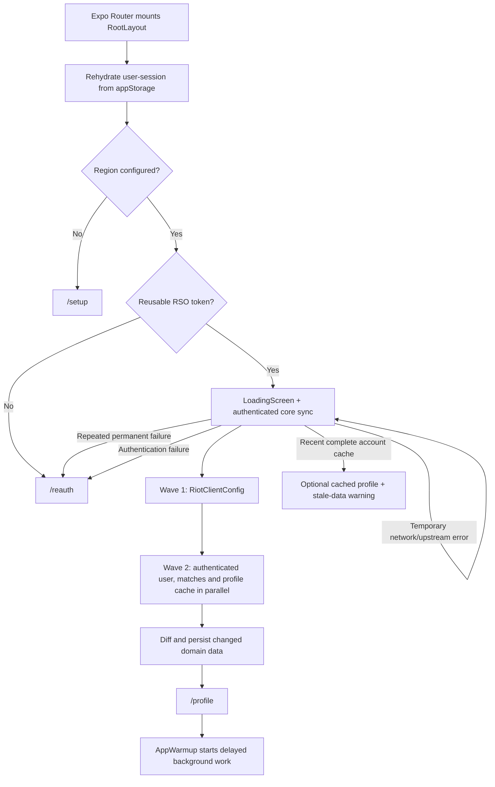
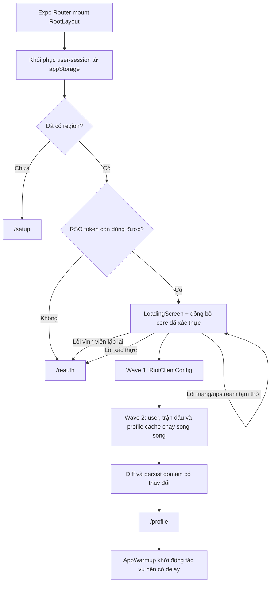

# VShop

<a href="https://github.com/GinzaTech/Vshop/releases/latest">
  
</a>
<a href="https://github.com/GinzaTech/Vshop/releases/latest">
  
</a>
<a href="https://hosted.weblate.org/engage/vshop/">
  
</a>

A third-party companion app for **Valorant** — browse the daily store, check match history, view your profile loadout, track competitive rank, chat with friends, and more.

---

## Table of Contents

- [English](#english)
  - [Features](#features)
  - [Tech Stack](#tech-stack)
  - [Architecture](#architecture)
  - [Prerequisites](#prerequisites)
  - [Installation](#installation)
  - [Development](#development)
  - [Build](#build)
  - [Credits](#credits)
- [Tiếng Việt](#tiếng-việt)
  - [Tính năng](#tính-năng)
  - [Công nghệ](#công-nghệ)
  - [Kiến trúc](#kiến-trúc)
  - [Yêu cầu hệ thống](#yêu-cầu-hệ-thống)
  - [Cài đặt](#cài-đặt)
  - [Phát triển](#phát-triển)
  - [Build](#build-1)
  - [Ghi công](#ghi-công)

---

# English

## Release 4.1.4 highlights

- **Security and recovery release (26 August 2026):** encrypts Riot sessions and saved accounts with a Keystore/Keychain-protected key, validates Riot chat TLS certificates, restricts OAuth navigation, checks OTA updates on normal launch and recovers transient Riot/network failures without discarding good cached data.
- **Large friend-list recovery:** preserves an incomplete Riot roster until its closing XMPP stanza arrives, preventing large rosters from timing out after launch or foreground recovery.
- **Consistent collection cards:** Equipment and the Skin Gallery now use the Store card hierarchy while retaining their existing filters, media preview and wishlist interactions.

- **Latest production OTA (28 August 2026):** primary tabs now mount on demand, freeze and detach while inactive; Profile supports vertical collapse gestures from its hero and empty areas; navigation uses the ghost-free fade-through motion described below.
- **Reliable primary navigation:** Bundle, Store, Profile and More now use a short fade-through over the solid app background, so the active indicator and page change feel continuous without sideways jumps or overlapping Android elevation ghosts.
- **Natural Profile scrolling:** vertical drags from the player card and empty content areas collapse the Profile header, while horizontal skin and collection gestures keep their existing behavior.
- **Web-safe profile export:** native media-library code is isolated from the web static renderer.
- **Modern runtime:** upgraded to Expo SDK 57, React Native 0.86, React 19, Reanimated 4 and Zustand 5.
- **Safer API architecture:** Riot/public traffic now uses isolated clients, a typed endpoint registry, validation, contract tests and read-only smoke tests. Profile and Combat Session are thin routes backed by feature modules, while CI reports app-wide coverage separately from stricter critical-domain thresholds.
- **Refresh everywhere:** authenticated data screens, empty states, Match Session and chat support pull-to-refresh with duplicate-request protection.
- **Complete leaderboard history:** every started Act can be selected, with Episode/Act labels, newest-first ordering and stale-response protection.
- **Smoother motion:** shared timing/spring tokens keep high-frequency interaction animation on the UI thread and respect system Reduce Motion.
- **Expo Blur compatibility:** Android blur targets use the current BlurView API without deprecated-property warnings.

See [CHANGELOG.md](CHANGELOG.md) for the complete release notes and validation details.

## Features

| Category | Features |
|---|---|
| **Store** | Daily shop (4 skins), Night Market, Bundles, Accessory shop, Item upgrades |
| **Profile** | Loadout editor, Collection browser, Rare+ collection image export, animated Act record and player-performance cards |
| **Match History** | Cached history, season metrics, daily summaries, landscape scoreboard, economy, weapon statistics, opponent matchups and round timeline |
| **Combat** | Live pregame/session information, party management, silent leave-party action, agent select and real-time match board |
| **Social** | Friends list with presence, resilient 1:1 Riot XMPP messaging and party chat |
| **Reference** | Skin gallery, equipment browser, agent database, crosshair codes, leaderboard |
| **Performance** | Offline-first MMKV cache, delta sync, gzip compression, adaptive TTL on 4G |
| **UX** | Animated loading screen, skeleton shimmer, press-scale cards, sliding tab indicator, screen transitions |

## Tech Stack

| Layer | Technology |
|---|---|
| **Framework** | React Native 0.86 + Expo SDK 57 |
| **Routing** | Expo Router (file-based) |
| **State** | Zustand 5 + persist middleware |
| **Storage** | MMKV cache + AES-256 MMKV session storage with a Keychain/Keystore-protected key; AsyncStorage migration/fallback |
| **Animations** | react-native-reanimated 4.5 with centralized motion tokens |
| **UI** | react-native-paper, custom glassmorphism design system |
| **i18n** | react-i18next (18 languages) |
| **Network** | axios with gzip, keep-alive, request dedup |
| **Images** | expo-image (memory-disk cache) |
| **Auth** | Riot RSO OAuth2 (WebView) |
| **Chat** | XMPP over TCP socket (react-native-tcp-socket) |
| **Payments** | Stripe (native) |
| **Analytics** | Plausible, Sentry (native) |
| **OTA Updates** | expo-updates |

## Architecture

VShop is a client-side, offline-first React Native application. Screens do not
own Riot sessions or long-lived network state: routes compose domain stores,
domain stores call the service layer, and the service layer normalizes Riot
responses before they reach the UI.

### Runtime layers

| Layer | Primary responsibility | Main locations |
|---|---|---|
| **Application shell** | Providers, splash lifecycle, bootstrap, initial route, global error boundary and portrait policy | `app/_layout.tsx` |
| **Navigation** | Public authentication/setup stack, authenticated tabs, hidden secondary routes and landscape match session | `app/`, `app/(authenticated)/` |
| **Screens and components** | Route orchestration, user interaction and presentation; no persistent transport ownership | `app/`, `components/` |
| **Domain state** | User session, match history, profile warm cache, combat snapshot, wishlist and feature state | `hooks/`, `utils/chat-store.ts` |
| **Services** | Riot HTTP calls, RSO session construction, XMPP, synchronization, asset loading and image prefetch | `utils/` |
| **Persistence** | Zustand cache persistence over MMKV; Riot sessions use encrypted MMKV on native and tab-scoped `sessionStorage` on web | `utils/storage.ts` |
| **Contracts and assets** | Riot DTOs, normalized match UI types, design tokens, images and 18 translation bundles | `types/`, `constants/`, `assets/` |

### Startup and authentication



1. `useUserStore` rehydrates the persisted `user-session`; routing does not
   begin until its `hydrated` flag is set.
2. `RootLayout` resolves the region from AsyncStorage and the persisted user.
   A missing region enters setup; a missing or near-expiry token enters RSO
   reauthentication.
3. A resumable session calls `syncAllData` and keeps the existing branded
   loading shell visible until client config, authenticated user data, initial
   match state and profile warm cache are usable.
4. Network timeouts, rate limits and Riot 5xx responses retain the session and
   retry with bounded backoff. The loading shell exposes immediate retry and,
   only after a previous complete account-matched sync within 72 hours, an
   explicit cached-data fallback. Authentication failures renew the RSO session.
5. Repeated permanent contract/configuration failures route to `/reauth`
   instead of leaving the loading shell in an endless retry loop.

The authenticated shell mounts `AppWarmup`, which deliberately staggers work:
shop/balance refresh after 3 seconds, match refresh after 5.2 seconds on Wi-Fi
or 7.8 seconds on cellular, and XMPP startup after 250/900 ms respectively. It
also checks token expiry every two minutes and refreshes a session when fewer
than five minutes remain.

### State, cache and consistency model

| Domain | Persistence and lifetime | Consistency rules |
|---|---|---|
| **User/session** | Persisted as `user-session` | Region + user ID identify the session; JWT expiry is checked with a safety buffer before reuse |
| **Profile** | `profile-warm-cache`, 5-minute TTL, newest 3 accounts | Loadout and rank have explicit schema versions; requests are deduplicated by `region\|userId` |
| **Match history** | `match-history-cache`, 30-minute TTL | Persists summaries and season metrics; detail payloads stay in a 10-entry in-memory LRU |
| **Season metrics** | Persisted with a calculation version, 2-hour TTL | Active-Act competitive update IDs are the source of truth; incomplete detail sets are rejected rather than producing partial statistics |
| **Combat** | Memory-only snapshot | Party, pregame and live endpoints are resolved together; stale responses are discarded and live sessions poll every 10 seconds |
| **Chat** | Memory-only Zustand store | One XMPP client per credential/region key; messages and presence are normalized by Riot PUUID and deduplicated |
| **Assets** | File-system cache, 24-hour TTL, plus memory lookup maps | Public metadata is language-aware; in-flight loads and bundle requests are shared |

Persisted Profile and Match results carry an `authKey`. Their async actions
compare that key again before committing a response, so a slow request from a
previous account cannot overwrite the current account. In-flight Promise
registries deduplicate identical user, profile, match-detail, bundle and
player-name requests.

### Domain data pipelines

**Profile**

```text
RSO session
  -> loadout + six ownership categories + competitive MMR (parallel)
  -> normalize skin/spray/flex/card/title IDs and current/peak rank
  -> versioned profile cache keyed by region|userId
  -> Profile tabs render immediately, then refresh stale sections
```

**Match history and current-Act statistics**

```text
Match history pages + competitive updates
  -> create lightweight 30-match records
  -> choose request concurrency from network profile
  -> hydrate 15 records on cellular or 30 on Wi-Fi
  -> normalize players, teams, rounds, economy, weapons and rank changes
  -> persist summaries; keep full detail payloads in memory

Active Act from Riot content
  -> page through every competitive update for that Act
  -> fetch each unique match detail with bounded retries
  -> calculate wins/losses, K/D, HS, ACS, ADR, KAST and weapon aggregates
  -> publish only when the complete detail set is available
```

When a populated match cache expires, the normal refresh checks only the newest
five records and appends unknown match IDs. Full pagination and hydration are
reserved for an empty cache, a forced refresh, or the user requesting more
history.

**Combat**

```text
Party player + pregame player + current-game player (parallel)
  -> fetch available party/pregame/live payloads
  -> batch-resolve Riot subjects to GameName#TagLine
  -> build one snapshot with priority pregame > live > idle
  -> combat and combat_session screens subscribe to the same Zustand state
```

**Friends and party chat**

```text
RSO token -> PAS token + chat affinity
  -> TLS socket :5223
  -> SASL X-Riot-RSO-PAS
  -> resource bind + XMPP session + entitlements
  -> roster, presence, direct messages and party MUC
  -> normalized chat store -> Friends / direct chat / party chat UI
```

The XMPP service is a singleton guarded against duplicate initialization.
Unexpected socket closure schedules exponential reconnects from 2.5 seconds up
to 30 seconds. Successful writes are inserted into local state immediately and
incoming echoes are deduplicated. Native TCP is required, so Riot chat is not
available in Expo Go or web builds.

### Navigation, orientation and platform boundaries

- The root Stack owns `setup`, `reauth`, language modal, direct chat and the
  authenticated route group.
- The authenticated group uses a custom floating tab bar for primary routes;
  detail, history, combat, friends and reference screens are registered as
  hidden secondary routes.
- `RootLayout` enforces portrait globally. `combat_session` temporarily acquires
  landscape while focused, waits for the landscape viewport before rendering its
  dense session layout, and restores portrait during cleanup. Android uses
  `adjustResize` so chat composers remain above the software keyboard. The
  optional native-module wrapper avoids crashing an older development client.
- Native/web variations use `.native.ts`, `.web.ts` and provider shims for
  cookies, background fetch and Stripe.

### Failure and performance boundaries

- `ErrorBoundary` protects the complete provider/navigation tree.
- Bootstrap distinguishes timeout from invalid authentication, allowing cached
  data to remain usable during slow networks.
- HTTP requests use bounded timeouts, redacted development logging and
  non-fatal fallbacks where partial domains can still render.
- `getNetworkProfile` caches connectivity for 15 seconds and limits work to two
  concurrent requests on cellular or four on Wi-Fi/web.
- Image prefetch uses the same network profile, bounded batches and URL
  deduplication; screens consume `expo-image` memory/disk caching.
- Zustand persistence stores compact records only. Volatile loading flags,
  sockets and heavy match details never cross an application restart.

## Prerequisites

### 1. ADB (Android Debug Bridge)
- Download [platform-tools](https://dl.google.com/android/repository/platform-tools-latest-windows.zip)
- Extract to `C:\platform-tools`
- Add to system PATH:
  - System Properties > Environment Variables > Path > Edit > New > `C:\platform-tools`
- Verify: `adb devices` should list your connected device

### 2. JDK 17
- [Download JDK 17](https://www.oracle.com/java/technologies/javase-jdk17-downloads.html)
- Set `JAVA_HOME` environment variable
- Add JDK `bin` to PATH
- Verify: `java -version`

### 3. Android Studio
- [Download Android Studio](https://developer.android.com/studio)
- Install Android SDK (API 34+)
- Set `ANDROID_HOME` environment variable

### 4. Node.js
- [Download Node.js v22+](https://nodejs.org/)
- Verify: `node -v` and `npm -v`

### 5. Expo CLI
```bash
npm install -g eas-cli
expo login
```

## Installation

```bash
# Clone the repository
git clone https://github.com/GinzaTech/Vshop.git
cd Vshop

# Install dependencies
npm install
```

## Development

```bash
# Start Metro bundler
npm start

# Run on Android device/emulator
npm run android

# Clear Metro cache (if needed)
npx expo start --clear
```

### Demo Mode (Match UI)

Match History and Match Details can be previewed with mock data in dev builds:

```text
/history?demo=1
/match_details/mock-match-001?demo=1
```

### Project Structure

```
app/                    # Expo Router screens
  (authenticated)/      # Tab navigator + all authenticated screens
  _layout.tsx           # Root layout (providers, bootstrap)
components/             # Reusable UI components
  ui/                   # Design system primitives (GlassCard, ValorantButton, etc.)
  matches/              # Match-related components
  match-detail/         # Match detail screen components
hooks/                  # Zustand stores (user, match, profile, wishlist, combat)
utils/                  # Business logic, API layer, caching, sync
constants/              # Design tokens, hardcoded data
services/               # Isolated HTTP clients, Riot endpoints, public API facade
types/                  # TypeScript type definitions
assets/                 # Images, i18n translations
```

## Build

See [BUILD_DESIGN_SYSTEM.md](BUILD_DESIGN_SYSTEM.md) for the complete design, validation, signing and release policy. Repository-wide coding rules are in [AGENTS.md](AGENTS.md).

### Development Build
```bash
pnpm dlx eas-cli@latest build --profile development --platform android
```

### Production Build
```bash
pnpm dlx eas-cli@latest build --profile production --platform android
```

Install via QR code or APK from the Expo dashboard.

## Credits

- **Author**: [vascYT](https://github.com/GinzaTech)
- [Unofficial Valorant API documentation](https://github.com/techchrism/valorant-api-docs)
- [In-game assets](https://valorant-api.com)
- All [translators](https://hosted.weblate.org/projects/vshop/mobile/) and contributors

---

# Tiếng Việt

## Điểm nổi bật bản 4.1.4

- **Bản bảo mật và phục hồi (26/08/2026):** mã hoá phiên Riot và tài khoản đã lưu bằng khoá được Keystore/Keychain bảo vệ, xác thực chứng chỉ TLS của Riot chat, giới hạn điều hướng OAuth, kiểm tra OTA khi mở app bình thường và phục hồi lỗi Riot/mạng tạm thời mà không xoá cache tốt.
- **Khôi phục danh sách bạn bè lớn:** giữ nguyên roster Riot đang nhận dở cho tới khi stanza XMPP đóng hoàn chỉnh, tránh timeout sau khi mở app hoặc quay lại từ nền.

- **OTA production mới nhất (28/08/2026):** tab chính chỉ mount khi dùng, được freeze và detach khi không hoạt động; Profile kéo dọc được từ hero và khoảng trống; thanh điều hướng dùng fade-through không tạo bóng mờ như mô tả bên dưới.
- **Điều hướng chính ổn định:** Bundle, Store, Profile và More chuyển trang bằng fade-through ngắn qua nền đặc, giúp vòng chọn và nội dung chạy liền mạch mà không giật ngang hoặc chồng bóng elevation trên Android.
- **Cuộn Profile tự nhiên:** kéo dọc từ bảng người chơi và các khoảng trống đều thu gọn header, còn thao tác kéo ngang skin và bộ sưu tập vẫn giữ nguyên.
- **Profile tương thích web:** phần xuất ảnh dùng media-library native đã được tách khỏi trình render web tĩnh.
- **Runtime mới:** nâng lên Expo SDK 57, React Native 0.86, React 19, Reanimated 4 và Zustand 5.
- **Kiến trúc API an toàn hơn:** Riot/public API dùng client tách biệt; API Riot được chia thành các service account, loadout, match, combat và progression sau một facade tương thích mỏng. Endpoint registry có type, validation, contract test và smoke test chỉ đọc. Profile và Combat Session là route mỏng dùng feature module; account picker và segmented navigation của Profile cũng được test/tái sử dụng độc lập.
- **Kéo để tải lại toàn ứng dụng:** các màn dữ liệu, empty state, Phiên đấu và chat đều hỗ trợ refresh, đồng thời chặn request trùng.
- **Đầy đủ lịch sử bảng xếp hạng:** chọn được mọi Act đã bắt đầu, có nhãn Episode/Act, sắp xếp mới nhất và chống response cũ ghi đè.
- **Animation mượt và nhất quán:** timing/spring dùng token chung, chạy tương tác trên UI thread và tôn trọng Reduce Motion.
- **BlurView tương thích SDK mới:** Android dùng `blurTarget` và `blurMethod`, không còn cảnh báo prop deprecated.

Xem đầy đủ thay đổi và kết quả kiểm tra tại [CHANGELOG.md](CHANGELOG.md).

## Tính năng

| Danh mục | Tính năng |
|---|---|
| **Cửa hàng** | Shop hàng ngày (4 skin), Night Market, Bundle, Shop phụ kiện, Nâng cấp skin |
| **Profile** | Chỉnh loadout, xem bộ sưu tập, xuất ảnh skin Hiếm+, thống kê Act và thông tin người chơi có animation |
| **Lịch sử đấu** | Cache lịch sử, thống kê mùa, tóm tắt theo ngày, scoreboard ngang, kinh tế, vũ khí, đối đầu và timeline round |
| **Combat** | Thông tin pregame/live, quản lý party, rời party im lặng, chọn agent và bảng trận đấu trực tiếp |
| **Xã hội** | Danh sách bạn bè, nhắn tin Riot XMPP ổn định hơn và chat party |
| **Tham khảo** | Thư viện skin, trình duyệt trang bị, database agent, mã crosshair, bảng xếp hạng |
| **Hiệu năng** | Cache MMKV offline-first, delta sync, nén gzip, TTL thích ứng trên 4G |
| **Trải nghiệm** | Màn hình loading animation, skeleton shimmer, hiệu ứng bấm card, thanh tab trượt, chuyển màn hình mượt |

## Công nghệ

| Lớp | Công nghệ |
|---|---|
| **Framework** | React Native 0.86 + Expo SDK 57 |
| **Routing** | Expo Router (file-based) |
| **State** | Zustand 5 + persist middleware |
| **Storage** | MMKV cho cache + MMKV AES-256 cho session với khóa được bảo vệ bởi Keychain/Keystore; tự migrate/fallback AsyncStorage |
| **Animation** | react-native-reanimated 4.5 và motion token tập trung |
| **UI** | react-native-paper, design system glassmorphism tùy chỉnh |
| **Đa ngôn ngữ** | react-i18next (18 ngôn ngữ) |
| **Mạng** | axios với gzip, keep-alive, chống request trùng |
| **Ảnh** | expo-image (cache memory-disk) |
| **Xác thực** | Riot RSO OAuth2 (WebView) |
| **Chat** | XMPP qua TCP socket (react-native-tcp-socket) |
| **Thanh toán** | Stripe (native) |
| **Phân tích** | Plausible, Sentry (native) |
| **OTA** | expo-updates |

## Kiến trúc

VShop là ứng dụng React Native chạy phía client theo hướng offline-first. Màn
hình không tự giữ Riot session hoặc kết nối mạng dài hạn: route ghép các domain
store, store gọi lớp service, còn service chuẩn hóa response Riot trước khi đưa
dữ liệu tới UI.

### Các lớp runtime

| Lớp | Trách nhiệm chính | Vị trí |
|---|---|---|
| **Application shell** | Provider, splash lifecycle, bootstrap, route đầu tiên, error boundary toàn cục và quy tắc màn hình dọc | `app/_layout.tsx` |
| **Điều hướng** | Stack setup/đăng nhập, tab đã xác thực, route phụ ẩn và phiên đấu ngang | `app/`, `app/(authenticated)/` |
| **Màn hình và component** | Điều phối route, tương tác và hiển thị; không sở hữu transport lâu dài | `app/`, `components/` |
| **Domain state** | Session người dùng, lịch sử đấu, profile warm cache, combat snapshot, wishlist và feature state | `hooks/`, `utils/chat-store.ts` |
| **Service** | Riot HTTP, dựng RSO session, XMPP, đồng bộ, tải asset và preload ảnh | `utils/` |
| **Lưu trữ** | Cache Zustand qua MMKV; Riot session dùng MMKV mã hóa trên native và `sessionStorage` theo tab trên web | `utils/storage.ts` |
| **Contract và asset** | Riot DTO, kiểu match UI đã chuẩn hóa, design token, hình ảnh và 18 bộ ngôn ngữ | `types/`, `constants/`, `assets/` |

### Khởi động và xác thực



1. `useUserStore` khôi phục `user-session`; hệ thống chưa quyết định route cho
   tới khi cờ `hydrated` được bật.
2. `RootLayout` lấy region từ AsyncStorage và user đã lưu. Thiếu region thì vào
   setup; thiếu token hoặc token gần hết hạn thì vào luồng RSO reauthentication.
3. Session có thể dùng lại sẽ chạy `syncAllData` và giữ loading shell hiện tại
   cho đến khi client config, authenticated user, match state ban đầu và Profile
   warm cache dùng được.
4. Timeout mạng, rate limit và Riot 5xx giữ nguyên session/cache rồi retry với
   backoff có giới hạn. Lỗi xác thực sẽ thử dựng lại RSO session.
5. Lỗi contract/config vĩnh viễn lặp lại sẽ chuyển `/reauth` thay vì để loading
   shell retry vô hạn.

Sau khi đăng nhập, `AppWarmup` chủ động giãn các tác vụ: refresh shop/số dư sau
3 giây, refresh match sau 5,2 giây trên Wi-Fi hoặc 7,8 giây trên mạng di động,
và mở XMPP sau 250/900 ms tương ứng. Token được kiểm tra mỗi hai phút và dựng
lại session khi thời gian còn lại dưới năm phút.

### Mô hình state, cache và tính nhất quán

| Domain | Cách lưu và thời hạn | Quy tắc nhất quán |
|---|---|---|
| **User/session** | Persist bằng key `user-session` | Region + user ID định danh session; JWT được kiểm tra với khoảng an toàn trước khi dùng lại |
| **Profile** | `profile-warm-cache`, TTL 5 phút, giữ 3 tài khoản gần nhất | Loadout/rank có version cache riêng; request chống trùng theo `region\|userId` |
| **Lịch sử đấu** | `match-history-cache`, TTL 30 phút | Persist bản tóm tắt và thống kê mùa; detail đầy đủ chỉ ở LRU RAM tối đa 10 trận |
| **Thống kê mùa** | Persist kèm calculation version, TTL 2 giờ | Danh sách competitive update của Act là nguồn chuẩn; thiếu detail thì hủy kết quả thay vì tính số liệu thiếu |
| **Combat** | Snapshot chỉ nằm trong RAM | Party, pregame và live được ghép chung; response cũ bị bỏ và trận live poll mỗi 10 giây |
| **Chat** | Zustand store chỉ trong RAM | Một XMPP client cho mỗi bộ credential/region; message và presence chuẩn hóa theo Riot PUUID |
| **Asset** | File cache 24 giờ và lookup map trong RAM | Metadata công khai theo ngôn ngữ; các lần load và request bundle dùng chung Promise |

Kết quả Profile và Match được persist đều mang `authKey`. Trước khi ghi
response, async action của hai domain này kiểm tra lại key để request chậm của
tài khoản trước không thể ghi đè tài khoản đang dùng. Các registry Promise đang
chạy chống gọi trùng cho user, Profile, match detail, bundle và tên người chơi.

### Pipeline dữ liệu theo domain

**Profile**

```text
RSO session
  -> loadout + 6 nhóm vật phẩm sở hữu + competitive MMR (song song)
  -> chuẩn hóa ID skin/spray/flex/card/title và current/peak rank
  -> cache có version theo region|userId
  -> các tab Profile render ngay từ cache rồi refresh phần đã stale
```

**Lịch sử đấu và thống kê Act hiện tại**

```text
Các trang match history + competitive updates
  -> tạo record nhẹ cho 30 trận
  -> chọn concurrency theo loại mạng
  -> hydrate 15 trận trên mạng di động hoặc 30 trận trên Wi-Fi
  -> chuẩn hóa player, team, round, economy, vũ khí và thay đổi rank
  -> persist summary; giữ detail nặng trong RAM

Act hiện tại từ Riot content
  -> phân trang toàn bộ competitive update thuộc Act
  -> lấy từng match detail duy nhất với retry có giới hạn
  -> tính win/loss, K/D, HS, ACS, ADR, KAST và thống kê vũ khí
  -> chỉ publish khi có đủ toàn bộ detail
```

Khi match cache đã có dữ liệu nhưng hết TTL, refresh thông thường chỉ kiểm tra
năm trận mới nhất rồi thêm các Match ID chưa biết. Full pagination và hydrate
chỉ chạy khi cache rỗng, người dùng force refresh hoặc yêu cầu tải thêm lịch sử.

**Combat**

```text
Party player + pregame player + current-game player (song song)
  -> lấy payload party/pregame/live đang tồn tại
  -> batch resolve Riot subject thành GameName#TagLine
  -> tạo một snapshot theo ưu tiên pregame > live > idle
  -> combat và combat_session cùng subscribe một Zustand state
```

**Bạn bè và party chat**

```text
RSO token -> PAS token + chat affinity
  -> TLS socket :5223
  -> SASL X-Riot-RSO-PAS
  -> bind resource + XMPP session + entitlements
  -> roster, presence, tin nhắn riêng và party MUC
  -> chat store đã chuẩn hóa -> UI Bạn bè / chat riêng / party chat
```

XMPP service là singleton và có khóa chống khởi tạo socket trùng. Khi socket
đóng ngoài ý muốn, service reconnect theo exponential backoff từ 2,5 giây tới
tối đa 30 giây. Tin nhắn ghi socket thành công được thêm vào local state ngay;
echo nhận lại sẽ bị loại trùng. Riot chat cần native TCP nên không hoạt động
trong Expo Go hoặc bản web.

### Điều hướng, orientation và ranh giới nền tảng

- Root Stack sở hữu `setup`, `reauth`, modal ngôn ngữ, chat riêng và group route
  đã xác thực.
- Group đã xác thực dùng floating tab bar tùy chỉnh cho route chính; các màn
  detail, history, combat, friends và tham khảo được đăng ký làm route phụ ẩn.
- `RootLayout` giữ toàn app ở portrait. `combat_session` tạm sở hữu landscape
  khi focus và trả lại portrait lúc cleanup. Wrapper native optional giúp dev
  client cũ không crash nếu chưa build module orientation.
- Khác biệt native/web được tách bằng `.native.ts`, `.web.ts` và provider shim
  cho cookie, background fetch và Stripe.

### Ranh giới lỗi và hiệu năng

- `ErrorBoundary` bọc toàn bộ cây provider và điều hướng.
- Bootstrap phân biệt timeout với sai xác thực để cache vẫn dùng được khi mạng
  chậm.
- HTTP có timeout giới hạn, log dev che thông tin nhạy cảm và fallback không
  chặn khi một domain riêng vẫn có thể hiển thị.
- `getNetworkProfile` cache trạng thái mạng 15 giây, giới hạn hai request song
  song trên mạng di động hoặc bốn request trên Wi-Fi/web.
- Preload ảnh dùng cùng network profile, batch có giới hạn và chống URL trùng;
  màn hình dùng cache memory/disk của `expo-image`.
- Zustand chỉ persist record gọn. Loading flag, socket và match detail nặng
  không được ghi qua lần khởi động tiếp theo.

## Yêu cầu hệ thống

### 1. ADB (Android Debug Bridge)
- Tải [platform-tools](https://dl.google.com/android/repository/platform-tools-latest-windows.zip)
- Giải nén vào `C:\platform-tools`
- Thêm vào PATH:
  - System Properties > Environment Variables > Path > Edit > New > `C:\platform-tools`
- Kiểm tra: `adb devices` phải hiện thiết bị đã kết nối

### 2. JDK 17
- [Tải JDK 17](https://www.oracle.com/java/technologies/javase-jdk17-downloads.html)
- Đặt biến `JAVA_HOME`
- Thêm JDK `bin` vào PATH
- Kiểm tra: `java -version`

### 3. Android Studio
- [Tải Android Studio](https://developer.android.com/studio)
- Cài Android SDK (API 34+)
- Đặt biến `ANDROID_HOME`

### 4. Node.js
- [Tải Node.js v22+](https://nodejs.org/)
- Kiểm tra: `node -v` và `npm -v`

### 5. Expo CLI
```bash
npm install -g eas-cli
expo login
```

## Cài đặt

```bash
# Clone dự án
git clone https://github.com/GinzaTech/Vshop.git
cd Vshop

# Cài dependencies
npm install
```

## Phát triển

```bash
# Khởi động Metro bundler
npm start

# Chạy trên thiết bị/máy ảo Android
npm run android

# Xóa cache Metro (khi cần)
npx expo start --clear
```

### Chế độ Demo (UI Lịch sử đấu)

Có thể xem trước Lịch sử đấu và Chi tiết trận bằng mock data trong bản dev:

```text
/history?demo=1
/match_details/mock-match-001?demo=1
```

### Cấu trúc dự án

```
app/                    # Màn hình Expo Router
  (authenticated)/      # Tab navigator + tất cả màn hình đã đăng nhập
  _layout.tsx           # Layout gốc (providers, bootstrap)
components/             # Component UI tái sử dụng
  ui/                   # Primitives design system (GlassCard, ValorantButton, ...)
  matches/              # Component liên quan trận đấu
  match-detail/         # Component màn hình chi tiết trận
hooks/                  # Zustand stores (user, match, profile, wishlist, combat)
utils/                  # Logic, API layer, cache, sync
constants/              # Design tokens, dữ liệu cố định
services/               # HTTP client tách biệt, Riot endpoints, public API facade
types/                  # Định nghĩa kiểu TypeScript
assets/                 # Ảnh, bản dịch i18n
```

## Build

Xem [BUILD_DESIGN_SYSTEM.md](BUILD_DESIGN_SYSTEM.md) để biết đầy đủ quy tắc design, kiểm tra, signing và release. Quy tắc sửa code toàn repository nằm trong [AGENTS.md](AGENTS.md).

### Build Development
```bash
pnpm dlx eas-cli@latest build --profile development --platform android
```

### Build Production
```bash
pnpm dlx eas-cli@latest build --profile production --platform android
```

Cài qua QR code hoặc file APK từ dashboard Expo.

## Ghi công

- **Tác giả**: [vascYT](https://github.com/GinzaTech)
- [Tài liệu API Valorant không chính thức](https://github.com/techchrism/valorant-api-docs)
- [Asset trong game](https://valorant-api.com)
- Tất cả [người dịch](https://hosted.weblate.org/projects/vshop/mobile/) và người đóng góp

---

## Translations

Translations are available on [Weblate](https://hosted.weblate.org/projects/vshop/mobile/).

## License

MIT License - see [LICENSE](LICENSE) for details.
