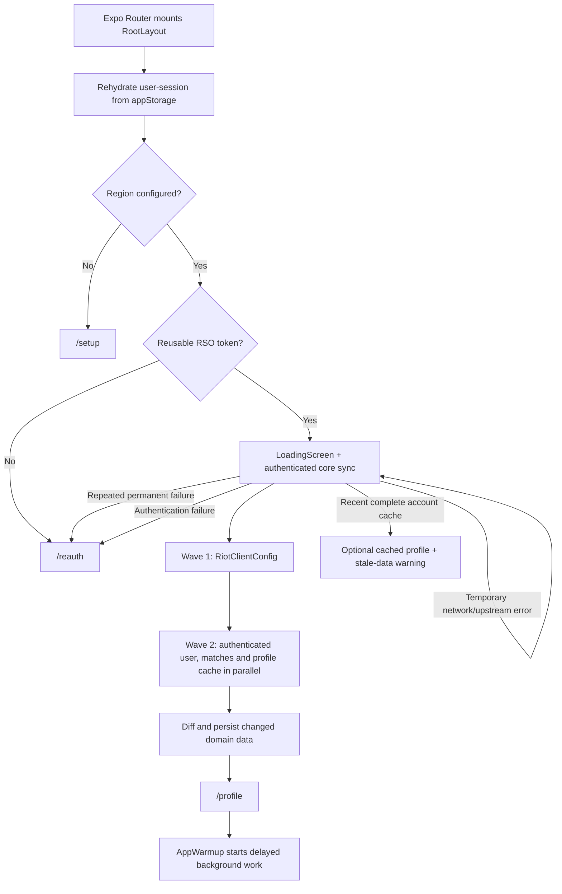
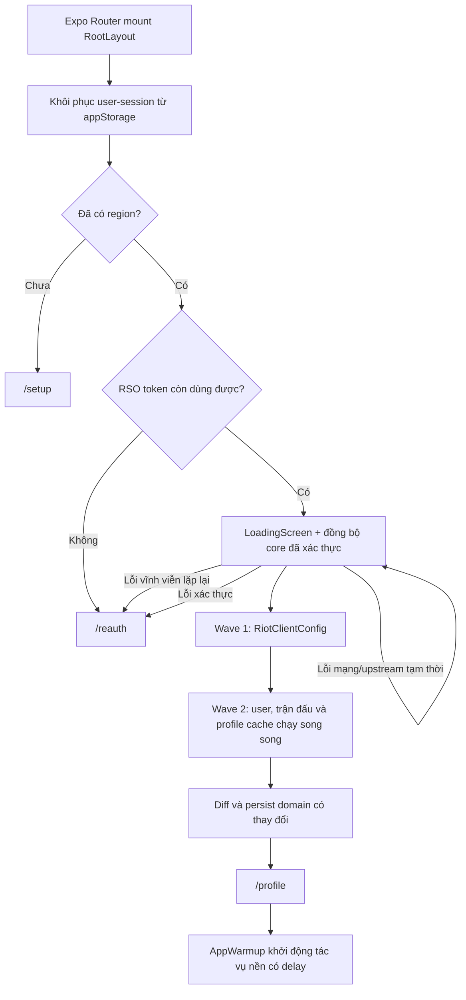

# VShop

<a href="https://github.com/GinzaTech/Vshop/releases/latest">
  
</a>
<a href="https://github.com/GinzaTech/Vshop/releases/latest">
  
</a>
<a href="https://hosted.weblate.org/engage/vshop/">
  
</a>

A third-party companion app for **Valorant** — browse the daily store, check match history, view your profile loadout, track competitive rank, chat with friends, and more.

The unreleased launcher icon uses the same sculpted cart as the startup screen,
with an opaque common icon and a safely padded Android adaptive foreground.
See [asset provenance](assets/generated/production/startup/vshop-app-icon-v1.provenance.md).
Changing the installed launcher icon requires a new native build.

Latest connected main Expo checks show VP/RP/KC and AP fully readable in Profile.
Its equipped player-card artwork occupies one third of its row at120dp height; Bundle previews use a3.2 ratio
for50% more height at unchanged width. Night Market's explicit artwork dimensions
fill card width on the device. Five primary views, Bundle disclosure, Profile
mode round-trip and Night preview were replayed; larger fonts and new frame-rate
performance are not inferred from those checks. See the
[latest physical results](markdown/ui-quality/MOBILE_FULL_TEST_RESULTS.md).

Commerce skin previews now share a centered popup modeled on the supplied
reference: a large still image opens first, Video is explicit, Level uses a red
segmented control and Variant uses real catalog swatches. Store, Night Market and
weapon cells in expanded Bundles use the same viewer. The Profile equipment-mode
pill is visually smaller with its Android48dp hit target retained; the three
Profile content tabs clamp Android overscroll at the final content while retaining
refresh and bottom-navigation clearance. These latest layouts are source/export
verified; physical popup and end-scroll replay remain pending when VShop regains
the phone foreground.

Navigation motion uses shared timing tokens, retained primary scenes and live OS Reduce Motion preferences. The latest capsule restores white Liquid Glass: a light page-only blur, translucent white veil, dark labels and a refractive moving lens, preserving icon animations without an outer rim or shadow. Missing/unsupported targets and Reduce Transparency use an opaque white fallback; hidden/collapsed navigation stops backdrop blur. Profile and More retain unchanged presentation during focus updates, reducing measured Expo press-to-React-commit delay; native frame metrics are reported separately. Pages use neutral gray #eceef0 without decorative wallpaper. Store's four daily cards use a larger two-by-two phone grid. Night Market budgets six offers into two columns and three rows on normal phones, with artwork frames explicitly filling card width. Bundle has a taller wide preview banner, ending time below, and initially closed details that slide open on press. Profile keeps compact cards, larger graffiti/Flex choices and bounded thumbnail-cache warmup; region and equipment-mode labels reserve room for complete text. See [the motion system](BUILD_DESIGN_SYSTEM.md#4-motion-system), [UI refinements](markdown/plans/2026-10-05-ui-refinements.md), [captured corrections](markdown/plans/2026-10-05-captured-layout-corrections.md) and [restored white glass](markdown/plans/2026-10-05-restore-white-liquid-navigation.md). Current default-font main Expo screenshots and control replays are recorded separately from source checks and frame-rate claims.

Authorized local desktop testing can use the fail-closed
[`pnpm run web:pentest` workflow](markdown/DESKTOP_PENTEST_COMPANION.md): Riot
credentials stay in a separate Riot-owned browser window, authenticated HTTP
reads use a capability-bound loopback gateway, and account mutations are
blocked by default. This development companion is not a production RSO backend.

---

## Table of Contents

- [English](#english)
  - [Features](#features)
  - [Tech Stack](#tech-stack)
  - [Architecture](#architecture)
  - [Prerequisites](#prerequisites)
  - [Installation](#installation)
  - [Development](#development)
  - [Build](#build)
  - [Credits](#credits)
- [Tiếng Việt](#tiếng-việt)
  - [Tính năng](#tính-năng)
  - [Công nghệ](#công-nghệ)
  - [Kiến trúc](#kiến-trúc)
  - [Yêu cầu hệ thống](#yêu-cầu-hệ-thống)
  - [Cài đặt](#cài-đặt)
  - [Phát triển](#phát-triển)
  - [Build](#build-1)
  - [Ghi công](#ghi-công)

---

# English

## Features

| Category | Features |
|---|---|
| **Store** | Daily shop (4 skins), Night Market, Bundles, Accessory shop, Item upgrades |
| **Profile** | Loadout editor, Collection browser, Rare+ collection image export, animated Act record and player-performance cards |
| **Match History** | Cached history, season metrics, daily summaries, landscape scoreboard, economy, weapon statistics, opponent matchups and round timeline |
| **Combat** | Live pregame/session information, party management, silent leave-party action, agent select and real-time match board |
| **Social** | Friends list with presence and resilient 1:1 Riot XMPP messaging |
| **Reference** | Skin gallery, equipment browser, agent database, crosshair codes, leaderboard |
| **Performance** | Offline-first MMKV working cache, per-Act SQLite match archive on native, delta sync, gzip compression, adaptive TTL on 4G |
| **UX** | Animated loading screen, skeleton shimmer, press-scale cards, sliding tab indicator, screen transitions |

## Tech Stack

| Layer | Technology |
|---|---|
| **Framework** | React Native 0.86 + Expo SDK 57 |
| **Routing** | Expo Router (file-based) |
| **State** | Zustand 5 + persist middleware |
| **Storage** | MMKV working cache + native SQLite match archive; AES-256 MMKV session storage with a Keychain/Keystore-protected key; AsyncStorage migration/fallback |
| **Animations** | react-native-reanimated 4.5 with centralized motion tokens |
| **Icons** | typed `AppIcon` semantics → exact-version Lucide ESM `IconNode` data → Morphicons → `react-native-svg`; custom local pistol path, no icon-font fallback |
| **UI** | react-native-paper, custom glassmorphism design system |
| **i18n** | react-i18next (18 languages) |
| **Network** | axios with gzip, keep-alive and request dedup; capability-bound loopback gateway for local Expo Web pentesting |
| **Images** | expo-image (memory-disk cache) |
| **Auth** | Riot RSO OAuth2 (native WebView; isolated local browser broker for Expo Web pentesting) |
| **Chat** | XMPP over TCP socket (react-native-tcp-socket) |
| **Analytics** | Plausible, Sentry (native) |
| **OTA Updates** | expo-updates |

## Architecture

VShop is a client-side, offline-first React Native application. Screens do not
own Riot sessions or long-lived network state: routes compose domain stores,
domain stores call the service layer, and the service layer normalizes Riot
responses before they reach the UI.

### Runtime layers

| Layer | Primary responsibility | Main locations |
|---|---|---|
| **Application shell** | Providers, splash lifecycle, bootstrap, initial route, global error boundary and portrait policy | `app/_layout.tsx` |
| **Navigation** | Public authentication/setup stack, authenticated tabs, hidden secondary routes and landscape match session | `app/`, `app/(authenticated)/` |
| **Screens and components** | Route orchestration, user interaction and presentation; no persistent transport ownership | `app/`, `components/` |
| **Domain state** | User session, match history, profile warm cache, combat snapshot, wishlist and feature state | `hooks/`, `utils/chat-store.ts` |
| **Services** | Riot HTTP calls, RSO session construction, XMPP, synchronization, asset loading and image prefetch | `utils/` |
| **Persistence** | Zustand cache persistence over MMKV; durable match summaries use per-account/per-Act SQLite on native; Riot sessions use encrypted MMKV on native and tab-scoped `sessionStorage` on web | `utils/storage.ts`, `services/matches/` |
| **Contracts and assets** | Riot DTOs, normalized match UI types, design tokens, images and 18 translation bundles | `types/`, `constants/`, `assets/` |

### Startup and authentication


```mermaid
flowchart TD
  A["Expo Router mounts RootLayout"] --> B["Rehydrate user-session from appStorage"]
  B --> C{"Region configured?"}
  C -- "No" --> D["/setup"]
  C -- "Yes" --> E{"Reusable RSO token?"}
  E -- "No" --> F["/reauth"]
  E -- "Yes" --> G["LoadingScreen + authenticated core sync"]
  G --> H["Wave 1: RiotClientConfig"]
  H --> I["Wave 2: authenticated user, matches and profile cache in parallel"]
  I --> J["Diff and persist changed domain data"]
  J --> K["/profile"]
  G -- "Temporary network/upstream error" --> G
  G -- "Recent complete account cache" --> M["Optional cached profile + stale-data warning"]
  G -- "Repeated permanent failure" --> F
  G -- "Authentication failure" --> F
  K --> L["AppWarmup starts delayed background work"]
```

1. `useUserStore` rehydrates the persisted `user-session`; routing does not
   begin until its `hydrated` flag is set.
2. `RootLayout` resolves the region from AsyncStorage and the persisted user.
   A missing region enters setup; a missing or near-expiry token enters RSO
   reauthentication.
3. A resumable session calls `syncAllData` and keeps the existing branded
   loading shell visible until client config, authenticated user data, initial
   match state and profile warm cache are usable.
4. Network timeouts, rate limits and Riot 5xx responses retain the session and
   retry with bounded backoff. The loading shell identifies likely maintenance
   and offers the latest complete same-account snapshot with its last-sync time,
   even when older than 72 hours. The 72-hour boundary still distinguishes a
   fresh cache; stale fallback remains an explicit user choice. Authentication
   failures renew the RSO session instead of being labelled as maintenance.
5. Repeated permanent contract/configuration failures route to `/reauth`
   instead of leaving the loading shell in an endless retry loop.

The authenticated shell mounts `AppWarmup`, which deliberately staggers work:
shop/balance refresh after 3 seconds, match refresh after 5.2 seconds on Wi-Fi
or 7.8 seconds on cellular, and XMPP startup after 250/900 ms respectively. It
also checks token expiry every two minutes and refreshes a session when fewer
than five minutes remain.

Native saved accounts retain an encrypted Riot cookie snapshot per account.
Before a switch or silent renewal, VShop restores only the selected account's
snapshot and rejects any renewed token whose subject does not match that
account. Web sessions remain tab-scoped and require interactive sign-in after
their bearer token expires because HttpOnly cookies cannot be snapshotted from
browser JavaScript.

### State, cache and consistency model

| Domain | Persistence and lifetime | Consistency rules |
|---|---|---|
| **User/session** | Persisted as `user-session` | Region + user ID identify the session; JWT expiry is checked with a safety buffer before reuse |
| **Profile** | `profile-warm-cache`, 5-minute TTL, newest 3 accounts | Per-component freshness and schema versions; in-flight requests include credential identity and session generation |
| **Match history** | `match-history-cache`, 30-minute TTL | Persists summaries and season metrics; detail payloads stay in a 10-entry in-memory LRU |
| **Observed-match archive** | Native SQLite keyed by account + Act; existing storage adapter on web/test | Keeps the newest 1,000 hydrated Competitive summaries per Act beyond the 200-record working-cache limit, deduplicates Match IDs and stores neither credentials nor full detail payloads |
| **Act recording baseline** | Immutable local timestamp per normalized account, mirrored into the Match store | Starts the current Act at zero, excludes pre-baseline matches/options/cache statistics without deleting recoverable archive rows, then exposes each completed future Act |
| **Season metrics** | Per-Act UI cache with calculation version and 2-hour TTL, backed by the durable archive | Archive, competitive updates and retained history provide available metrics; older Acts fall back to Riot MMR win/loss totals, leaving unavailable combat metrics blank; cancelled/unknown outcomes do not enter win rate |
| **Combat** | Memory-only snapshot | Party, pregame and live resolve together; stale responses are discarded; Party/tracker poll every 3 seconds after the previous wave settles while focused/foreground |
| **Chat** | Memory-only Zustand store | One XMPP client per credential/region key; messages and presence are normalized by Riot PUUID and deduplicated |
| **Assets** | File-system cache, 24-hour TTL, plus memory lookup maps | Public metadata is language-aware; in-flight loads and bundle requests are shared |

Persisted Profile and Match results carry an `authKey`. Async writes check the
live account, both credentials and session generation, not just that persisted
key. In-flight Promise
registries deduplicate identical user, profile, match-detail, bundle and
player-name requests.

### Domain data pipelines

**Profile**

```text
RSO session
  -> loadout + six ownership categories + competitive MMR (parallel)
  -> normalize skin/spray/flex/card/title IDs and current/peak rank
  -> versioned profile cache keyed by region|userId
  -> Profile tabs render immediately, then refresh stale sections
```

**Match history and multi-Act statistics**

```text
Match history pages + competitive updates
  -> create lightweight 30-match records
  -> choose request concurrency from network profile
  -> hydrate 15 records on cellular or 30 on Wi-Fi
  -> normalize players, teams, rounds, economy, weapons and rank changes
  -> persist the 200-record working set and merge hydrated Competitive summaries
     into the account + Act archive; keep full detail payloads in memory

Selected Act from Riot content (newest to oldest)
  -> hydrate the local archive first; a completed historical snapshot needs no re-crawl
  -> page through competitive updates until the Act is found or safely passed
  -> fall back to retained match history and verify queue + seasonId in match detail
  -> calculate wins/losses, K/D, HS, ACS, ADR and KAST from available details
  -> if old details have expired, use Riot MMR's per-season game/win totals
  -> render unavailable combat metrics as -- and persist the per-Act result
```

When a populated match cache expires, the normal refresh checks only the newest
five records and appends unknown match IDs. Full pagination and hydration are
reserved for an empty cache, a forced refresh, or the user requesting more
history.

**Combat**

```text
Party player + pregame player + current-game player (parallel)
  -> fetch available party/pregame/live payloads
  -> batch-resolve Riot subjects to GameName#TagLine
  -> build one snapshot with priority pregame > live > idle
  -> combat and combat_session screens subscribe to the same Zustand state
```

**Friends and direct chat**

```text
RSO token -> PAS token + chat affinity
  -> TLS socket :5223
  -> SASL X-Riot-RSO-PAS
  -> resource bind + XMPP session + entitlements
  -> roster, presence and direct messages
  -> normalized chat store -> Friends / direct chat UI
```

The XMPP service is a singleton guarded against duplicate initialization.
Unexpected socket closure schedules exponential reconnects from 2.5 seconds up
to 30 seconds. Successful writes are inserted into local state immediately and
incoming echoes are deduplicated. Native TCP is required, so Riot chat is not
available in Expo Go or web builds.

### Navigation, orientation and platform boundaries

- The root Stack owns `setup`, `reauth`, language modal, direct chat and the
  authenticated route group.
- The authenticated group uses a custom floating tab bar for primary routes;
  detail, history, combat, friends and reference screens are registered as
  hidden secondary routes.
- `RootLayout` enforces upright portrait on every route except `combat_session`,
  which stays locked to landscape while focused and waits for the landscape
  viewport before rendering its dense session layout. The route-specific lock
  is re-applied whenever the app returns from the background. Android uses
  `adjustResize` so chat composers remain above the software keyboard. The
  optional native-module wrapper avoids crashing an older development client.
- Native/web variations use `.native.ts` and `.web.ts` entry points for
  cookies and background fetch. Cookie logic lives in `utils/riot-cookies.ts`;
  the web entry point remains a no-op and does not load the native manager.

### Failure and performance boundaries

- `ErrorBoundary` protects the complete provider/navigation tree.
- Bootstrap distinguishes timeout from invalid authentication, allowing cached
  data to remain usable during slow networks.
- HTTP requests use bounded timeouts, redacted development logging and
  non-fatal fallbacks where partial domains can still render.
- `getNetworkProfile` caches connectivity for 15 seconds and limits work to two
  concurrent requests on cellular or four on Wi-Fi/web.
- Image prefetch uses the same network profile, bounded batches and URL
  deduplication; screens consume `expo-image` memory/disk caching.
- Zustand persistence stores compact records only. Volatile loading flags,
  sockets and heavy match details never cross an application restart.

## Prerequisites

### 1. ADB (Android Debug Bridge)
- Download [platform-tools](https://dl.google.com/android/repository/platform-tools-latest-windows.zip)
- Extract to `C:\platform-tools`
- Add to system PATH:
  - System Properties > Environment Variables > Path > Edit > New > `C:\platform-tools`
- Verify: `adb devices` should list your connected device

### 2. JDK 17
- [Download JDK 17](https://www.oracle.com/java/technologies/javase-jdk17-downloads.html)
- Set `JAVA_HOME` environment variable
- Add JDK `bin` to PATH
- Verify: `java -version`

### 3. Android Studio
- [Download Android Studio](https://developer.android.com/studio)
- Install Android SDK (API 34+)
- Set `ANDROID_HOME` environment variable

### 4. Node.js
- [Download Node.js v22+](https://nodejs.org/)
- Verify: `node -v` and `pnpm -v` (use the version in `packageManager`).

### 5. Expo CLI
```bash
pnpm add -g eas-cli
expo login
```

## Installation

```bash
# Clone the repository
git clone https://github.com/GinzaTech/Vshop.git
cd Vshop

# Install dependencies
pnpm install --frozen-lockfile
```

## Development

```bash
# Start Metro bundler
pnpm start

# Run on Android device/emulator
pnpm run android

# Clear Metro cache (if needed)
pnpm exec expo start --clear
```

`pnpm run check` runs TypeScript, zero-warning ESLint, app-wide tests/coverage,
dependency audit, Android export and bundle budget. `check:source` and
`check:android` are available separately; the Android step removes its own
temporary export directory on success or failure.

Diagnostics are off by default. Opt in only in a development build with
`EXPO_PUBLIC_FLOW_TRACING=1` or `EXPO_PUBLIC_API_LOGGING=1`, then restart Metro.
Storage values and credentials are excluded/redacted, URL identifiers are
removed, and legacy API log files are cleared. Do not enable diagnostics for
normal use or share unreviewed logs. Source/component tests do not prove
real-device UI behavior; see [the current audit](LOGIC_AUDIT.md).

### Guarded OpenCode worker

Codex may delegate an approved implementation plan to the project-local
`codex-worker` only inside a clean managed worktree. Create the task packet
outside the repository, then run:

```powershell
pnpm run worker:opencode -- --task-file <absolute-json-path>
```

The runner requires an exact refreshed GLM 5.3 model, finite edit paths,
structured pnpm test commands and a stable post-exit write window. It never
commits, pushes or releases, and `PASS_TO_REVIEW` still requires Codex to read
the complete diff and rerun every applicable project gate. To roll back the
machine CLI, use `pnpm remove --global opencode-ai`; never use
`opencode uninstall`, because that can remove shared OpenCode configuration or
session data.

### Demo Mode (Match UI)

Match History and Match Details can be previewed with mock data in dev builds:

```text
/history?demo=1
/match_details/mock-match-001?demo=1
```

### Project Structure

```
app/                    # Expo Router screens
  (authenticated)/      # Tab navigator + all authenticated screens
  _layout.tsx           # Root layout (providers, bootstrap)
components/             # Reusable UI components
  ui/                   # Design primitives and the sole AppIcon/Morphicons boundary
    AppIcon.tsx          # Renders every semantic icon through MorphIcon
    app-icon-registry.ts # Semantic AppIconName -> IconNode definitions
    app-icon-lucide.ts   # Only Lucide runtime deep-ESM import boundary
  matches/              # Match-related components
  match-detail/         # Match detail screen components
hooks/                  # Zustand stores (user, match, profile, wishlist, combat)
utils/                  # Business logic, API layer, caching, sync
constants/              # Design tokens, hardcoded data
services/               # Isolated HTTP clients, Riot endpoints, public API facade
types/                  # TypeScript type definitions
assets/                 # Images, i18n translations
```

## Build

See [BUILD_DESIGN_SYSTEM.md](BUILD_DESIGN_SYSTEM.md) for the complete design, validation, signing and release policy. Repository-wide coding rules are in [AGENTS.md](AGENTS.md).

### Development Build
```bash
pnpm dlx eas-cli@latest build --profile development --platform android
```

### Production Build
```bash
pnpm dlx eas-cli@latest build --profile production --platform android
```

The local Android export gate and every EAS build profile use
`EXPO_UNSTABLE_METRO_OPTIMIZE_GRAPH=1` and
`EXPO_UNSTABLE_TREE_SHAKING=1`; `production-store` inherits the production
environment.

The `@hyeon004/vshop` EAS production environment has both optimizer values set.
Production builds use EAS-managed Android credentials; local release builds keep
the repository's fail-closed production-keystore guard. Download the latest
verified APK and its changelog from the
[latest GitHub Release](https://github.com/GinzaTech/Vshop/releases/latest).

## Credits

- **Author**: [vascYT](https://github.com/GinzaTech)
- [Unofficial Valorant API documentation](https://github.com/techchrism/valorant-api-docs)
- [In-game assets](https://valorant-api.com)
- All [translators](https://hosted.weblate.org/projects/vshop/mobile/) and contributors

---

# Tiếng Việt

## Tính năng

| Danh mục | Tính năng |
|---|---|
| **Cửa hàng** | Shop hàng ngày (4 skin), Night Market, Bundle, Shop phụ kiện, Nâng cấp skin |
| **Profile** | Chỉnh loadout, xem bộ sưu tập, xuất ảnh skin Hiếm+, thống kê Act và thông tin người chơi có animation |
| **Lịch sử đấu** | Cache lịch sử, thống kê mùa, tóm tắt theo ngày, scoreboard ngang, kinh tế, vũ khí, đối đầu và timeline round |
| **Combat** | Thông tin pregame/live, quản lý party, rời party im lặng, chọn agent và bảng trận đấu trực tiếp |
| **Xã hội** | Danh sách bạn bè, nhắn tin Riot XMPP ổn định hơn và chat party |
| **Tham khảo** | Thư viện skin, trình duyệt trang bị, database agent, mã crosshair, bảng xếp hạng |
| **Hiệu năng** | Working cache MMKV offline-first, kho trận SQLite theo Act trên native, delta sync, nén gzip, TTL thích ứng trên 4G |
| **Trải nghiệm** | Màn hình loading animation, skeleton shimmer, hiệu ứng bấm card, thanh tab trượt, chuyển màn hình mượt |

## Công nghệ

| Lớp | Công nghệ |
|---|---|
| **Framework** | React Native 0.86 + Expo SDK 57 |
| **Routing** | Expo Router (file-based) |
| **State** | Zustand 5 + persist middleware |
| **Storage** | MMKV cho working cache + SQLite native cho kho trận; MMKV AES-256 cho session với khóa được bảo vệ bởi Keychain/Keystore; tự migrate/fallback AsyncStorage |
| **Animation** | react-native-reanimated 4.5 và motion token tập trung |
| **Icon** | semantic `AppIcon` có type → Lucide ESM `IconNode` đúng version → Morphicons → `react-native-svg`; pistol path local, không có fallback icon font |
| **UI** | react-native-paper, design system glassmorphism tùy chỉnh |
| **Đa ngôn ngữ** | react-i18next (18 ngôn ngữ) |
| **Mạng** | axios với gzip, keep-alive, chống request trùng |
| **Ảnh** | expo-image (cache memory-disk) |
| **Xác thực** | Riot RSO OAuth2 (WebView) |
| **Chat** | XMPP qua TCP socket (react-native-tcp-socket) |
| **Phân tích** | Plausible, Sentry (native) |
| **OTA** | expo-updates |

## Kiến trúc

VShop là ứng dụng React Native chạy phía client theo hướng offline-first. Màn
hình không tự giữ Riot session hoặc kết nối mạng dài hạn: route ghép các domain
store, store gọi lớp service, còn service chuẩn hóa response Riot trước khi đưa
dữ liệu tới UI.

### Các lớp runtime

| Lớp | Trách nhiệm chính | Vị trí |
|---|---|---|
| **Application shell** | Provider, splash lifecycle, bootstrap, route đầu tiên, error boundary toàn cục và quy tắc màn hình dọc | `app/_layout.tsx` |
| **Điều hướng** | Stack setup/đăng nhập, tab đã xác thực, route phụ ẩn và phiên đấu ngang | `app/`, `app/(authenticated)/` |
| **Màn hình và component** | Điều phối route, tương tác và hiển thị; không sở hữu transport lâu dài | `app/`, `components/` |
| **Domain state** | Session người dùng, lịch sử đấu, profile warm cache, combat snapshot, wishlist và feature state | `hooks/`, `utils/chat-store.ts` |
| **Service** | Riot HTTP, dựng RSO session, XMPP, đồng bộ, tải và cache asset | `utils/` |
| **Lưu trữ** | Cache Zustand qua MMKV; summary trận lâu dài dùng SQLite theo tài khoản/Act trên native; Riot session dùng MMKV mã hóa trên native và `sessionStorage` theo tab trên web | `utils/storage.ts`, `services/matches/` |
| **Contract và asset** | Riot DTO, kiểu match UI đã chuẩn hóa, design token, hình ảnh và 18 bộ ngôn ngữ | `types/`, `constants/`, `assets/` |

### Khởi động và xác thực


```mermaid
flowchart TD
  A["Expo Router mount RootLayout"] --> B["Khôi phục user-session từ appStorage"]
  B --> C{"Đã có region?"}
  C -- "Chưa" --> D["/setup"]
  C -- "Có" --> E{"RSO token còn dùng được?"}
  E -- "Không" --> F["/reauth"]
  E -- "Có" --> G["LoadingScreen + đồng bộ core đã xác thực"]
  G --> H["Wave 1: RiotClientConfig"]
  H --> I["Wave 2: user, trận đấu và profile cache chạy song song"]
  I --> J["Diff và persist domain có thay đổi"]
  J --> K["/profile"]
  G -- "Lỗi mạng/upstream tạm thời" --> G
  G -- "Lỗi vĩnh viễn lặp lại" --> F
  G -- "Lỗi xác thực" --> F
  K --> L["AppWarmup khởi động tác vụ nền có delay"]
```

1. `useUserStore` khôi phục `user-session`; hệ thống chưa quyết định route cho
   tới khi cờ `hydrated` được bật.
2. `RootLayout` lấy region từ AsyncStorage và user đã lưu. Thiếu region thì vào
   setup; thiếu token hoặc token gần hết hạn thì vào luồng RSO reauthentication.
3. Session có thể dùng lại sẽ chạy `syncAllData` và giữ loading shell hiện tại
   cho đến khi client config, authenticated user, match state ban đầu và Profile
   warm cache dùng được.
4. Timeout mạng, rate limit và Riot 5xx giữ nguyên session/cache rồi retry với
   backoff có giới hạn. Khi có snapshot hoàn chỉnh đúng tài khoản, loading shell
   báo VALORANT có thể đang bảo trì và cho xem dữ liệu gần nhất kèm thời điểm
   đồng bộ, kể cả cache cũ hơn 72 giờ. Cache cũ luôn cần người dùng chọn; lỗi xác
   thực sẽ thử dựng lại RSO session thay vì bị gắn nhãn bảo trì.
5. Lỗi contract/config vĩnh viễn lặp lại sẽ chuyển `/reauth` thay vì để loading
   shell retry vô hạn.

Sau khi đăng nhập, `AppWarmup` chủ động giãn các tác vụ: refresh shop/số dư sau
3 giây, refresh match sau 5,2 giây trên Wi-Fi hoặc 7,8 giây trên mạng di động,
và mở XMPP sau 250/900 ms tương ứng. Token được kiểm tra mỗi hai phút và dựng
lại session khi thời gian còn lại dưới năm phút.

Trên native, mỗi tài khoản đã lưu giữ một snapshot cookie Riot trong kho phiên
được mã hóa. Trước khi chuyển tài khoản hoặc silent renewal, VShop chỉ khôi phục
snapshot của tài khoản đích và từ chối token mới nếu subject không khớp tài
khoản đó. Bản web vẫn giới hạn phiên theo tab và cần đăng nhập tương tác sau khi
bearer token hết hạn vì JavaScript trình duyệt không thể snapshot cookie
HttpOnly.

### Mô hình state, cache và tính nhất quán

| Domain | Cách lưu và thời hạn | Quy tắc nhất quán |
|---|---|---|
| **User/session** | Persist bằng key `user-session` | Region + user ID định danh session; JWT được kiểm tra với khoảng an toàn trước khi dùng lại |
| **Profile** | `profile-warm-cache`, TTL 5 phút, giữ 3 tài khoản gần nhất | Freshness và version theo từng thành phần; request phân biệt credential identity và session generation |
| **Lịch sử đấu** | `match-history-cache`, TTL 30 phút | Persist bản tóm tắt và thống kê mùa; detail đầy đủ chỉ ở LRU RAM tối đa 10 trận |
| **Kho trận đã quan sát** | SQLite native theo tài khoản + Act; web/test dùng storage adapter sẵn có | Giữ tối đa 1.000 summary Competitive mới nhất mỗi Act ngoài giới hạn 200 record của working cache, chống trùng Match ID và không lưu credential hay full detail |
| **Mốc ghi nhận Act** | Timestamp cục bộ bất biến theo tài khoản đã chuẩn hoá, mirror vào Match store | Cho Act hiện tại bắt đầu từ 0, loại trận/option/cache thống kê trước mốc mà không xoá archive có thể phục hồi, rồi hiển thị từng Act tương lai đã hoàn tất |
| **Thống kê mùa** | UI cache từng Act có calculation version và TTL 2 giờ, được chống lưng bởi kho lâu dài | Archive, updates và history còn lưu cung cấp metric hiện có; Act quá cũ fallback tổng thắng/thua từ Riot MMR và để trống metric combat không còn nguồn; huỷ/chưa rõ không tính vào win rate |
| **Combat** | Snapshot chỉ nằm trong RAM | Party, pregame và live được ghép chung; bỏ response cũ; Party/tracker poll 3 giây sau khi wave trước xong, chỉ khi đang focus/foreground |
| **Chat** | Zustand store chỉ trong RAM | Một XMPP client cho mỗi bộ credential/region; message và presence chuẩn hóa theo Riot PUUID |
| **Asset** | File cache 24 giờ và lookup map trong RAM | Metadata công khai theo ngôn ngữ; các lần load và request bundle dùng chung Promise |

Kết quả Profile và Match được persist đều mang `authKey`. Trước khi ghi,
async action kiểm tra tài khoản hiện tại, cả hai credential và generation,
không chỉ key đã persist. Các registry Promise đang
chạy chống gọi trùng cho user, Profile, match detail, bundle và tên người chơi.

### Pipeline dữ liệu theo domain

**Profile**

```text
RSO session
  -> loadout + 6 nhóm vật phẩm sở hữu + competitive MMR (song song)
  -> chuẩn hóa ID skin/spray/flex/card/title và current/peak rank
  -> cache có version theo region|userId
  -> các tab Profile render ngay từ cache rồi refresh phần đã stale
```

**Lịch sử đấu và thống kê nhiều Act**

```text
Các trang match history + competitive updates
  -> tạo record nhẹ cho 30 trận
  -> chọn concurrency theo loại mạng
  -> hydrate 15 trận trên mạng di động hoặc 30 trận trên Wi-Fi
  -> chuẩn hóa player, team, round, economy, vũ khí và thay đổi rank
  -> persist working set 200 record và gộp summary Competitive đã hydrate vào
     kho theo tài khoản + Act; giữ detail nặng trong RAM

Act được chọn từ Riot content (mới nhất đến cũ nhất)
  -> hydrate kho cục bộ trước; snapshot Act cũ đã hoàn tất không cần crawl lại
  -> phân trang competitive updates tới khi gặp hoặc đi qua Act
  -> fallback match history còn lưu và xác nhận queue + seasonId bằng detail
  -> tính win/loss, K/D, HS, ACS, ADR, KAST từ các detail lấy được
  -> nếu detail Act cũ đã hết hạn, dùng tổng trận/thắng theo mùa từ Riot MMR
  -> metric combat không còn nguồn hiển thị --; kết quả từng Act được persist
```

Khi match cache đã có dữ liệu nhưng hết TTL, refresh thông thường chỉ kiểm tra
năm trận mới nhất rồi thêm các Match ID chưa biết. Full pagination và hydrate
chỉ chạy khi cache rỗng, người dùng force refresh hoặc yêu cầu tải thêm lịch sử.

**Combat**

```text
Party player + pregame player + current-game player (song song)
  -> lấy payload party/pregame/live đang tồn tại
  -> batch resolve Riot subject thành GameName#TagLine
  -> tạo một snapshot theo ưu tiên pregame > live > idle
  -> combat và combat_session cùng subscribe một Zustand state
```

**Bạn bè và chat riêng**

```text
RSO token -> PAS token + chat affinity
  -> TLS socket :5223
  -> SASL X-Riot-RSO-PAS
  -> bind resource + XMPP session + entitlements
  -> roster, presence và tin nhắn riêng
  -> chat store đã chuẩn hóa -> UI Bạn bè / chat riêng
```

XMPP service là singleton và có khóa chống khởi tạo socket trùng. Khi socket
đóng ngoài ý muốn, service reconnect theo exponential backoff từ 2,5 giây tới
tối đa 30 giây. Tin nhắn ghi socket thành công được thêm vào local state ngay;
echo nhận lại sẽ bị loại trùng. Riot chat cần native TCP nên không hoạt động
trong Expo Go hoặc bản web.

### Điều hướng, orientation và ranh giới nền tảng

- Root Stack sở hữu `setup`, `reauth`, modal ngôn ngữ, chat riêng và group route
  đã xác thực.
- Group đã xác thực dùng floating tab bar tùy chỉnh cho route chính; các màn
  detail, history, combat, friends và tham khảo được đăng ký làm route phụ ẩn.
- `RootLayout` khóa mọi route ngoài `combat_session` ở portrait hướng lên;
  `combat_session` luôn landscape trong suốt thời gian focus và chỉ render layout
  dày sau khi viewport ngang đã ổn định. Khóa theo route được áp lại mỗi khi app
  trở về foreground. Wrapper native optional giúp dev client cũ không crash nếu
  chưa build module orientation.
- Khác biệt native/web được tách bằng entry point `.native.ts` và `.web.ts`
  cho cookie và background fetch. Logic cookie dùng chung nằm ở
  `utils/riot-cookies.ts`; bản web không nạp cookie manager native.

### Ranh giới lỗi và hiệu năng

- `ErrorBoundary` bọc toàn bộ cây provider và điều hướng.
- Bootstrap phân biệt timeout với sai xác thực để cache vẫn dùng được khi mạng
  chậm.
- HTTP có timeout giới hạn, log dev che thông tin nhạy cảm và fallback không
  chặn khi một domain riêng vẫn có thể hiển thị.
- `getNetworkProfile` cache trạng thái mạng 15 giây, giới hạn hai request song
  song trên mạng di động hoặc bốn request trên Wi-Fi/web.
- Preload ảnh dùng cùng network profile, batch có giới hạn và chống URL trùng;
  màn hình dùng cache memory/disk của `expo-image`.
- Zustand chỉ persist record gọn. Loading flag, socket và match detail nặng
  không được ghi qua lần khởi động tiếp theo.

## Yêu cầu hệ thống

### 1. ADB (Android Debug Bridge)
- Tải [platform-tools](https://dl.google.com/android/repository/platform-tools-latest-windows.zip)
- Giải nén vào `C:\platform-tools`
- Thêm vào PATH:
  - System Properties > Environment Variables > Path > Edit > New > `C:\platform-tools`
- Kiểm tra: `adb devices` phải hiện thiết bị đã kết nối

### 2. JDK 17
- [Tải JDK 17](https://www.oracle.com/java/technologies/javase-jdk17-downloads.html)
- Đặt biến `JAVA_HOME`
- Thêm JDK `bin` vào PATH
- Kiểm tra: `java -version`

### 3. Android Studio
- [Tải Android Studio](https://developer.android.com/studio)
- Cài Android SDK (API 34+)
- Đặt biến `ANDROID_HOME`

### 4. Node.js
- [Tải Node.js v22+](https://nodejs.org/)
- Kiểm tra: `node -v` và `pnpm -v` (dùng phiên bản trong `packageManager`).

### 5. Expo CLI
```bash
pnpm add -g eas-cli
expo login
```

## Cài đặt

```bash
# Clone dự án
git clone https://github.com/GinzaTech/Vshop.git
cd Vshop

# Cài dependencies
pnpm install --frozen-lockfile
```

## Phát triển

```bash
# Khởi động Metro bundler
pnpm start

# Chạy trên thiết bị/máy ảo Android
pnpm run android

# Xóa cache Metro (khi cần)
pnpm exec expo start --clear
```

`pnpm run check` bao gồm TypeScript, ESLint không warning, test/coverage toàn
app, audit dependency, Android export và giới hạn dung lượng bundle. Có thể
chạy riêng `check:source` hoặc `check:android`; bước Android tự dọn thư mục
export tạm của lần chạy, kể cả khi lỗi.

Trace và API logging mặc định tắt. Chỉ bật để chẩn đoán bản dev bằng
`EXPO_PUBLIC_FLOW_TRACING=1` hoặc `EXPO_PUBLIC_API_LOGGING=1`, rồi khởi động
lại Metro. Giá trị storage/credential bị loại hoặc che, định danh trong URL
bị xoá và log API cũ được dọn. Không bật thường xuyên hoặc chia sẻ log chưa
kiểm tra. Test source/component không thay thế kiểm thử UI trên thiết bị;
kết quả hiện tại nằm trong [LOGIC_AUDIT.md](LOGIC_AUDIT.md).

Response JSON đầy đủ hơn (đã lọc dữ liệu nhạy cảm) có flag riêng
`EXPO_PUBLIC_API_RESPONSE_LOGGING=1`, chỉ hoạt động trong bản dev native.
Recorder quan sát response HTTP Riot/public, giữ asset/item ID để nối dữ liệu,
che credential/private identifier và báo rõ phần bị giới hạn hoặc bỏ qua.
JSONL nằm trong cache ứng dụng `api-responses/responses.jsonl`, không được
commit. Khởi động phiên chẩn đoán trong PowerShell:

```powershell
$env:EXPO_PUBLIC_API_RESPONSE_LOGGING = '1'
npm start
# Khi Expo sẵn sàng, nhấn a để mở development client Android.
```

Các API và dữ liệu có thể khai thác được mô tả trong
[API_RESPONSE_DIAGNOSTICS.md](markdown/API_RESPONSE_DIAGNOSTICS.md), cùng
phân biệt giữa contract nguồn và response đã quan sát trên thiết bị.

### OpenCode worker có guardrail

Codex chỉ được giao một implementation plan đã duyệt cho `codex-worker` cục bộ
khi worker chạy trong managed worktree sạch. Task packet phải nằm ngoài
repository, sau đó chạy:

```powershell
pnpm run worker:opencode -- --task-file <duong-dan-json-tuyet-doi>
```

Runner yêu cầu exact GLM 5.3 đã refresh, danh sách path hữu hạn, lệnh test pnpm
có cấu trúc và write window ổn định sau khi process thoát. Worker không commit,
push hoặc release; `PASS_TO_REVIEW` vẫn bắt buộc Codex đọc toàn bộ diff và chạy
lại mọi project gate phù hợp. Khi rollback CLI trên máy, dùng
`pnpm remove --global opencode-ai`; không dùng `opencode uninstall` vì lệnh đó
có thể xóa config hoặc session OpenCode dùng chung.

### Chế độ Demo (UI Lịch sử đấu)

Có thể xem trước Lịch sử đấu và Chi tiết trận bằng mock data trong bản dev:

```text
/history?demo=1
/match_details/mock-match-001?demo=1
```

### Cấu trúc dự án

```
app/                    # Màn hình Expo Router
  (authenticated)/      # Tab navigator + tất cả màn hình đã đăng nhập
  _layout.tsx           # Layout gốc (providers, bootstrap)
components/             # Component UI tái sử dụng
  ui/                   # Primitive design system và boundary AppIcon/Morphicons duy nhất
    AppIcon.tsx          # Render mọi semantic icon qua MorphIcon
    app-icon-registry.ts # AppIconName semantic -> định nghĩa IconNode
    app-icon-lucide.ts   # Boundary deep ESM import Lucide runtime duy nhất
  matches/              # Component liên quan trận đấu
  match-detail/         # Component màn hình chi tiết trận
hooks/                  # Zustand stores (user, match, profile, wishlist, combat)
utils/                  # Logic, API layer, cache, sync
constants/              # Design tokens, dữ liệu cố định
services/               # HTTP client tách biệt, Riot endpoints, public API facade
types/                  # Định nghĩa kiểu TypeScript
assets/                 # Ảnh, bản dịch i18n
```

## Build

Xem [BUILD_DESIGN_SYSTEM.md](BUILD_DESIGN_SYSTEM.md) để biết đầy đủ quy tắc design, kiểm tra, signing và release. Quy tắc sửa code toàn repository nằm trong [AGENTS.md](AGENTS.md).

### Build Development
```bash
pnpm dlx eas-cli@latest build --profile development --platform android
```

### Build Production
```bash
pnpm dlx eas-cli@latest build --profile production --platform android
```

Gate Android local và mọi profile EAS đều dùng
`EXPO_UNSTABLE_METRO_OPTIMIZE_GRAPH=1` cùng
`EXPO_UNSTABLE_TREE_SHAKING=1`; `production-store` kế thừa env production.

Production environment của EAS project `@hyeon004/vshop` đã set hai optimizer.
Build production dùng Android credentials do EAS quản lý; build release local
vẫn fail-closed nếu thiếu production keystore.

`pnpm dlx expo-doctor` hiện đạt 20/21 check. Điểm chưa đạt duy nhất là cảnh báo
đồng bộ patch SDK 57 đã được theo dõi riêng: sáu gói Expo đang chậm hơn một patch
so với khuyến nghị hiện tại của Doctor; migration icon này không tự ý nâng nhóm
dependency đó.

Cài qua QR code hoặc APK từ dashboard Expo. APK đã xác minh và changelog đi kèm
được đính tại [GitHub Release mới nhất](https://github.com/GinzaTech/Vshop/releases/latest).

## Ghi công

- **Tác giả**: [vascYT](https://github.com/GinzaTech)
- [Tài liệu API Valorant không chính thức](https://github.com/techchrism/valorant-api-docs)
- [Asset trong game](https://valorant-api.com)
- Tất cả [người dịch](https://hosted.weblate.org/projects/vshop/mobile/) và người đóng góp

---

## Translations

Translations are available on [Weblate](https://hosted.weblate.org/projects/vshop/mobile/).

## License

MIT License - see [LICENSE](LICENSE) for details.
