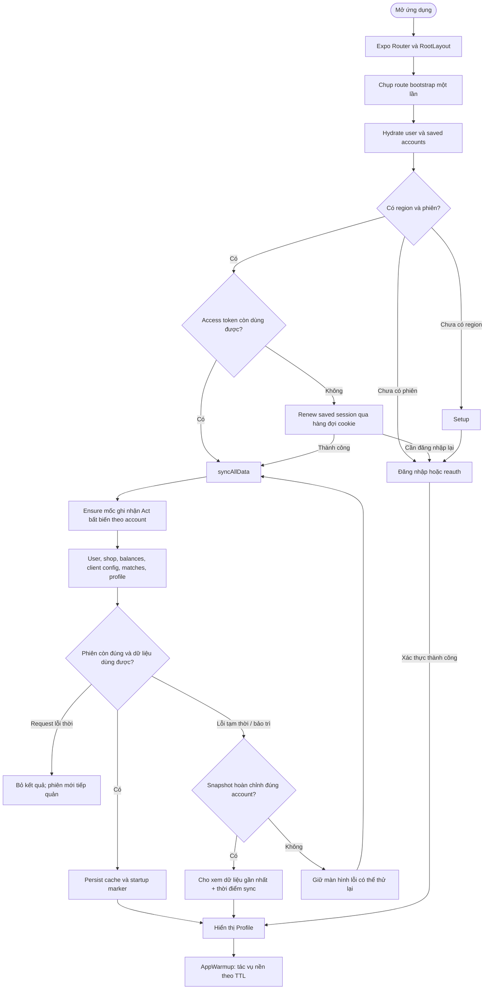

# 01 — Sơ đồ khối: khởi động VShop

Luồng quyết định chính của application shell; gom các bước nhỏ thành khối.

Đăng nhập WebView có luồng dựng user/preload riêng; không coi nó là cùng một
pipeline với mọi lần bootstrap. Startup marker phải hợp lệ và khớp account;
đọc metadata xong phải kiểm tra lại session generation và store hiện tại.
Mốc 72 giờ chỉ phân biệt cache fresh; khi Riot bảo trì, snapshot hoàn chỉnh cũ
hơn vẫn có thể được người dùng chọn thủ công và luôn hiển thị thời điểm sync.
Lỗi 401 hoặc Name Service 403 đi qua renew/reauth, không gắn nhãn bảo trì.
Route bootstrap được latch sau hydrate: điều hướng người dùng thực hiện trong
lúc sync không tạo dependency mới để cleanup/restart pipeline cũ.
Mốc Act chỉ được tạo một lần; sync sau đó không lùi timestamp hoặc phục hồi cache
mùa trước mốc.

Nguồn: [RootLayout](../app/_layout.tsx), [AppWarmup](../components/AppWarmup.tsx),
[data-sync](../utils/data-sync.ts), [startup-cache](../utils/startup-cache.ts).
Xem thêm [route bootstrap latch](../utils/root-bootstrap-route.ts) và
[recording baseline](../services/matches/match-recording-core.ts).
