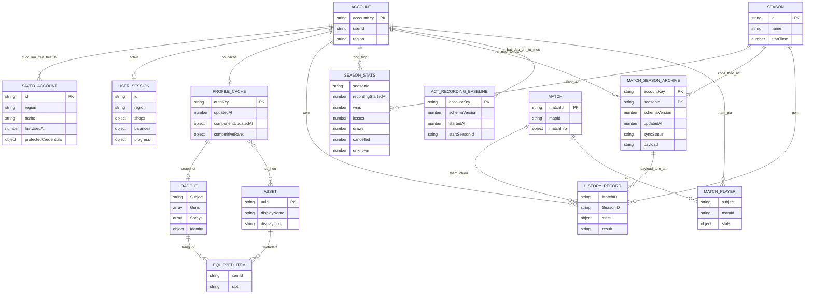

# 02 — Mô hình quan hệ thực thể (ERD)

Đây là **mô hình logic rút gọn**, không phải DDL. Key `accountKey` được chuẩn
hoá từ region và user ID. Một match có thể xuất hiện trong lịch sử của nhiều
người; store hiện tại chỉ sở hữu cache lịch sử của một account tại một thời điểm.

`protectedCredentials` và `result` ở đây là thuộc tính **khái niệm**: credential
nằm trong saved-account/session được bảo vệ, còn result lịch sử thực tế nằm
trong `stats.result`. `EQUIPPED_ITEM` là góc nhìn chuẩn hoá từ mảng loadout,
không phải một bảng đang tồn tại. `ACCOUNT` không có bảng riêng.

Trên native, `MATCH_SEASON_ARCHIVE` tương ứng bảng SQLite
`match_season_archives` với primary key kép `(account_key, season_id)`; `payload`
giữ snapshot JSON đã validate. `HISTORY_RECORD` và `SEASON_STATS` trong hình là
các object nằm trong payload, không phải bảng con SQL. Web/test dùng cùng
repository contract nhưng lưu qua `appStorage`.

`ACT_RECORDING_BASELINE` là metadata `appStorage` nhỏ, bất biến theo account.
`startSeasonId` được bind một lần khi Riot content xác định Act active. Stats và
archive trước `startedAt` không được đọc vào UI; row cũ vẫn được giữ vật lý.

Chat giữ friends/messages trong RAM; wishlist là danh sách asset UUID cục bộ,
không gán một quan hệ sở hữu account giả vì store wishlist không chia theo account.

Nguồn: [SavedAccount](../utils/saved-accounts.ts), [match types](../types/match-ui.ts),
[Profile cache](../utils/profile-cache.ts), [chat store](../utils/chat-store.ts),
[wishlist store](../hooks/useWishlistStore.ts),
[match archive](../services/matches/match-archive-core.ts),
[recording baseline](../services/matches/match-recording-core.ts).
