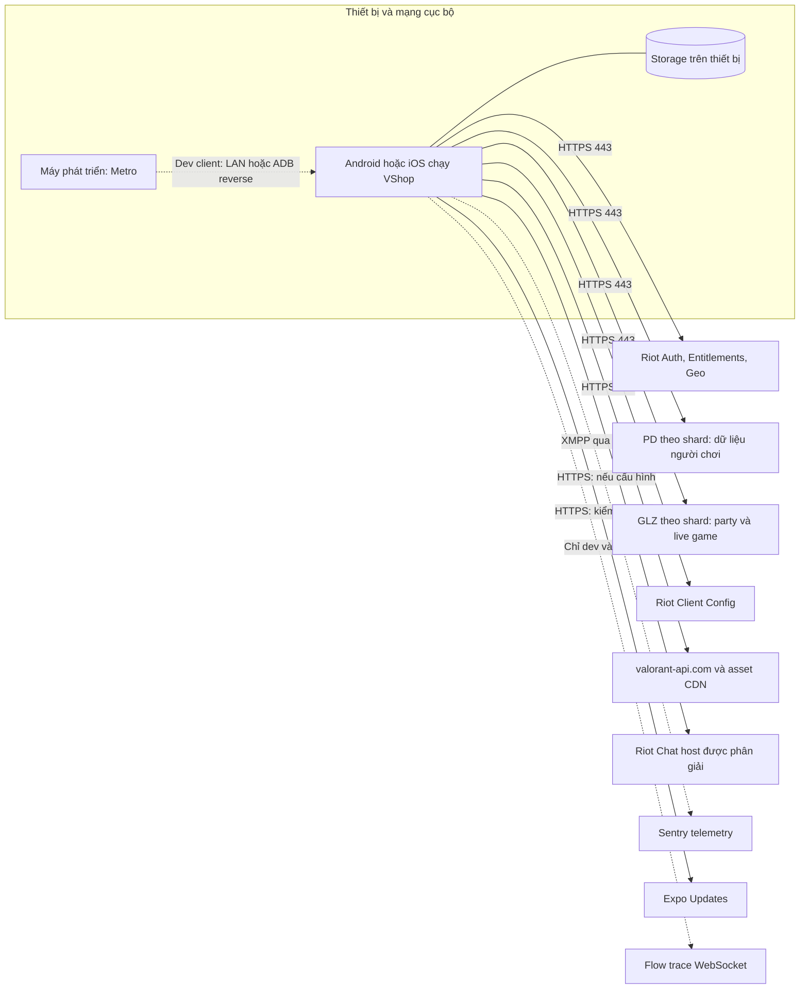

# 03 — Sơ đồ mạng máy tính

Topology logic của các kết nối ứng dụng. Không suy đoán router, VLAN hay địa
chỉ IP của người dùng; các hạ tầng cloud do bên ngoài quản lý.

Client HTTP Riot, public API và telemetry độc lập (timeout lần lượt 10s, 15s,
8s). Riot URL được tạo từ registry; shard được validate. XMPP kiểm tra host
Riot hợp lệ và chứng chỉ TLS. Metro/trace là đường phát triển, không phải
backend bắt buộc của bản production.

Nguồn: [HTTP clients](../services/http/clients.ts), [endpoints](../services/riot/endpoints.ts),
[XMPP](../utils/xmpp-client.ts), [chat service](../utils/chat-service.ts),
[Expo config](../app.json), [tracer](../utils/flow-tracer.ts).
