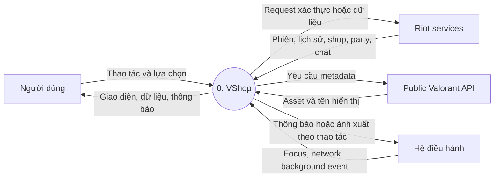
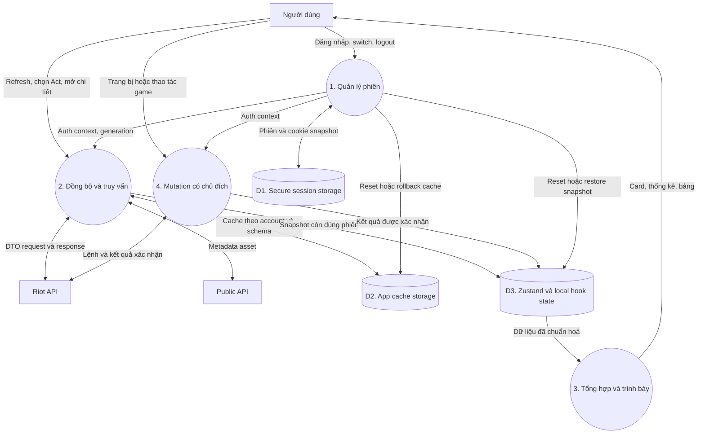

# 04 — Sơ đồ luồng dữ liệu (DFD)

Mũi tên ghi **dữ liệu**, không mô tả thứ tự thời gian. Kho D1/D2 là adapter
storage; D3 là state trong bộ nhớ, không phải database server.

## Mức ngữ cảnh

## Mức 1

Request lỗi thời bị chặn trước khi cập nhật D2/D3. Lỗi một nguồn Profile giữ
lại giá trị và tuổi cache của nguồn đó. Các mutation được mô tả vì app có
chức năng này, không có nghĩa đợt kiểm thử tự động đã thực hiện chúng.

Nguồn: [session](../services/accounts/session.ts), [sync](../utils/data-sync.ts),
[profile refresh](../features/profile/profile-refresh-data.ts), [storage](../utils/storage.ts).
