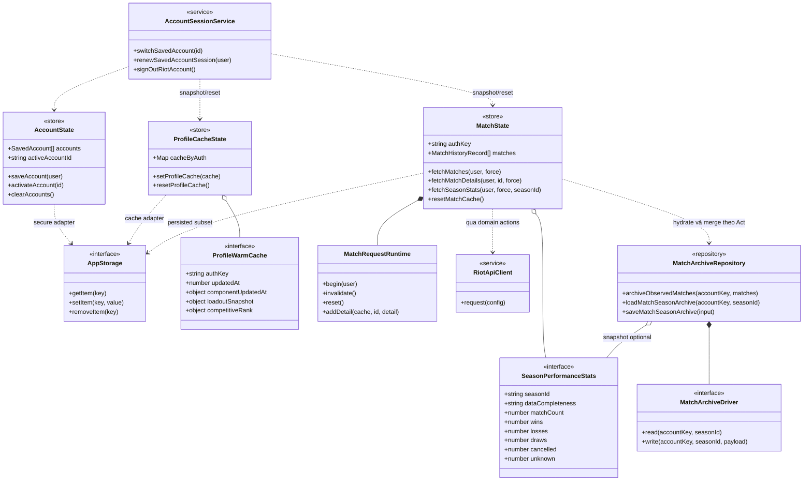

# 05 — Sơ đồ lớp/interface

Mô hình rút gọn các contract thật. Zustand store và module function không
được hiểu là class có constructor hay inheritance tại runtime.

`Map` trong hình là mô tả logic: `cacheByAuth` thực tế là `Record<string, ...>`.
Method signature đã lược bỏ return type/option để sơ đồ đọc được; TypeScript
là nguồn contract chính xác.

Nguồn: [storage interface](../utils/storage-migration.ts), [AccountState](../hooks/useAccountStore.ts),
[MatchState](../features/matches/store-types.ts), [Profile store](../hooks/useProfileCacheStore.ts),
[request runtime](../features/matches/request-runtime.ts),
[archive repository](../services/matches/match-archive-core.ts).
