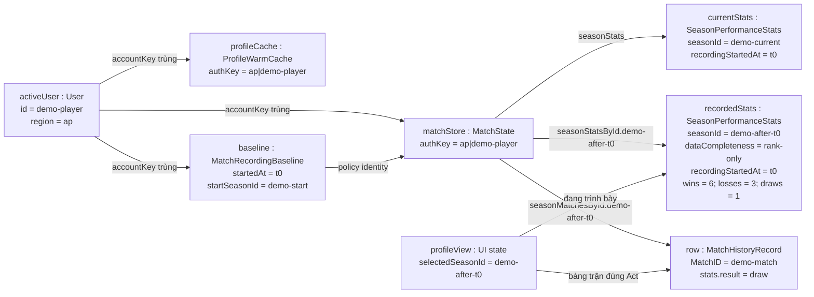

# 06 — Sơ đồ đối tượng: chọn Act đã ghi sau baseline

Snapshot giả định tại một thời điểm; mọi ID đều giả. Dùng flowchart để biểu
diễn instance và reference, không thay đổi state thật.

Chọn Act đã hoàn tất sau mốc không được thay `seasonStats` của Act hiện tại.
Act trước `t0` không có trong selector dù row archive legacy vẫn còn. Với ví dụ trên,
win rate = 6 / (6 + 3 + 1) = 60%; huỷ/chưa rõ không vào mẫu số. Snapshot
`rank-only` giữ được thắng/thua nhưng K/D, ADR, ACS, HS và KAST phải hiển thị
`--` vì Riot không còn match detail tương ứng.

Nguồn: [MatchState](../features/matches/store-types.ts),
[dữ liệu mùa Profile](../features/profile/profile-season-data.ts),
[season summary](../features/matches/season-summary.ts),
[MMR fallback](../features/matches/season-mmr-summary.ts),
[recording baseline](../services/matches/match-recording-core.ts).
