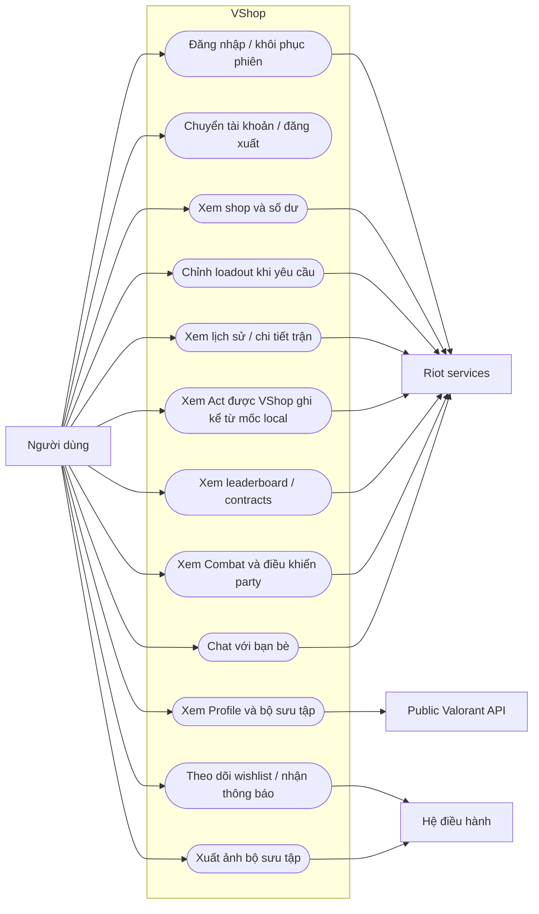

# 07 — Sơ đồ tình huống sử dụng

Các chức năng từ góc nhìn người dùng. Biểu diễn use case bằng khối bo tròn;
không thêm vai trò quản trị/backend không có trong dự án.

Điều kiện chung của chức năng Riot: phiên hợp lệ, region và quyền tương ứng.
Wishlist cần người dùng bật thông báo; xuất ảnh cần quyền hệ điều hành.
Xem thống kê và thay loadout là hai use case riêng: việc mở card không được
tự gây mutation tài khoản.
Act trước mốc local bị ẩn. Act hoàn tất sau mốc có thể chỉ còn dữ liệu xếp hạng
`rank-only`; UI phải nói đúng phần dữ liệu còn nguồn thay vì dựng số liệu combat
giả hoặc hứa độ phủ như Tracker. Act chứa mốc không dùng MMR full-Act vì nguồn đó
bao gồm cả trận trước mốc.

Nguồn: [routes](../app), [Profile](../features/profile/ProfileScreen.tsx),
[Combat](../features/combat/CombatSessionScreen.tsx), [wishlist](../utils/wishlist.ts),
[chat service](../utils/chat-service.ts).
