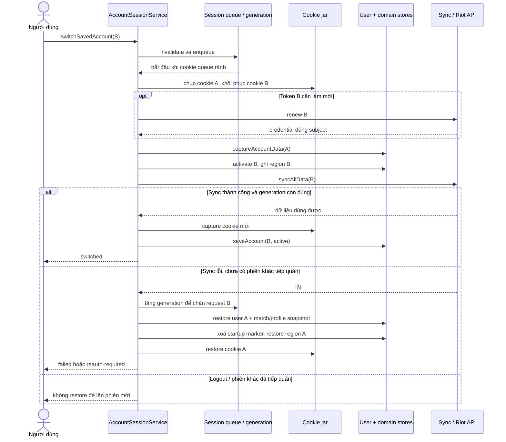

# 08 — Sơ đồ trình tự: switch account và rollback

Nhánh lỗi tập trung vào trường hợp B đã được activate trước khi sync thất bại.
Các lần capture cookie/renew chi tiết được gom để tránh che mất thứ tự dữ liệu.

Snapshot rollback chỉ chứa dữ liệu, không phục hồi promise, credential trong
request runtime hoặc cờ loading. Lỗi dọn startup marker không được ngắt việc
khôi phục region/cookie.
Archive mùa không bị copy giữa A và B: row được khóa bằng account + Act và chỉ
được hydrate khi auth key của account đang hoạt động khớp scope request.

Nguồn: [session](../services/accounts/session.ts),
[session-cache](../services/accounts/session-cache.ts),
[session queue](../utils/session-operations.ts),
[match archive](../services/matches/match-archive-core.ts).
