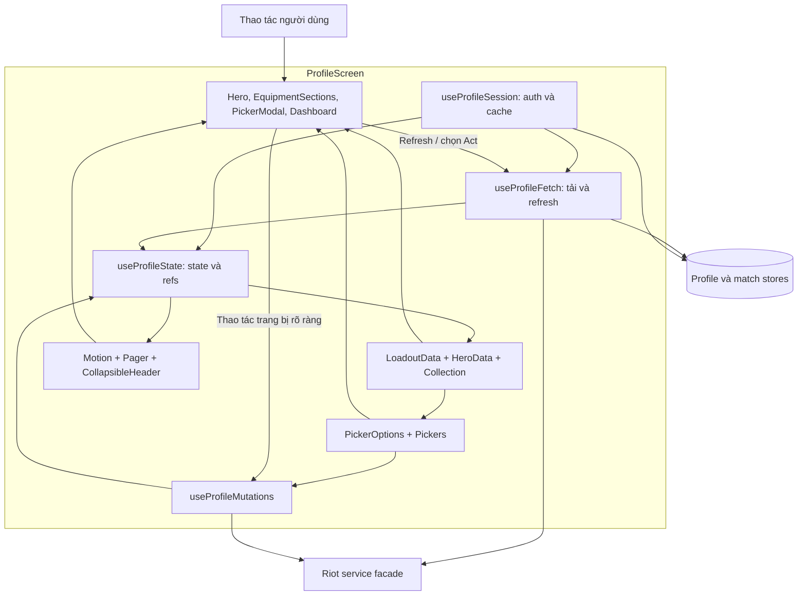

# 09 — Cấu trúc phối hợp bên trong Profile

Góc nhìn Composite Structure: các phần nội bộ cộng tác để tạo ra một màn
hình. Các port/part là ký pháp minh hoạ bằng Mermaid subgraph, không phải
component UML được công cụ sinh tự động.

Không có dependency từ HTTP client quay ngược vào UI. Các hook được tách theo
trách nhiệm; store liên tài khoản và state picker/motion cục bộ có vòng đời khác nhau.

Nguồn: [ProfileScreen](../features/profile/ProfileScreen.tsx),
[fetch](../features/profile/useProfileFetch.ts), [mutations](../features/profile/useProfileMutations.ts),
[motion](../features/profile/useProfileMotion.ts), [pager](../features/profile/useProfilePager.ts).
