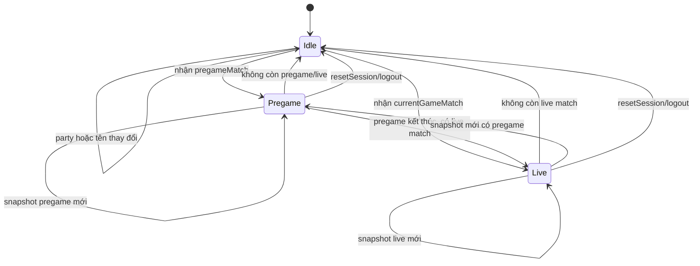
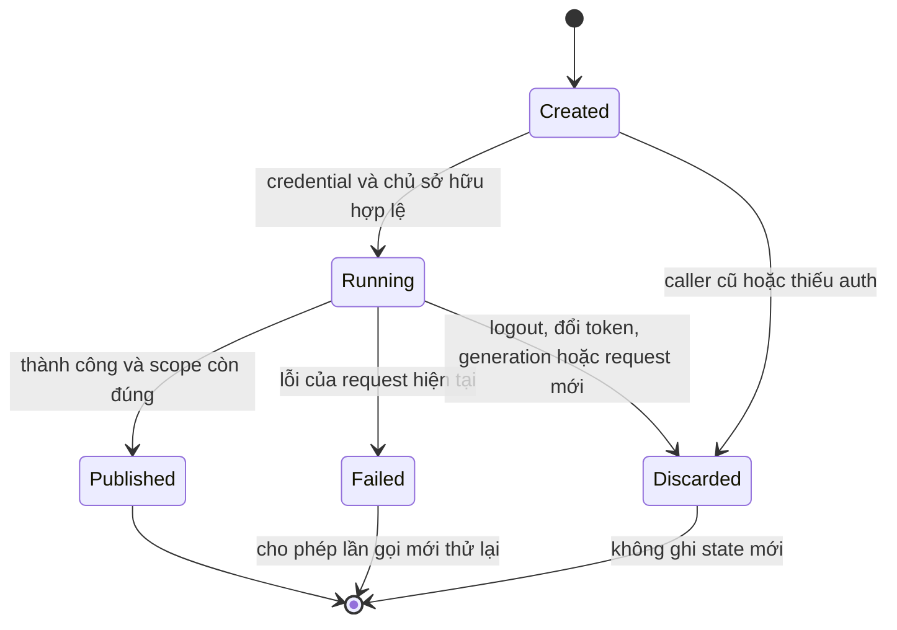

# 10 — Sơ đồ trạng thái

## Snapshot Combat

Nếu upstream trả đồng thời pregame và live, store ưu tiên pregame. Khi lỗi
mạng tạm thời, giữ snapshot tốt của cùng phiên; không suy ra idle chỉ từ lỗi.

## Vòng đời request

Focus/background là điều kiện **polling**, không phải một giá trị `snapshot.state`.
Ngừng poll không có nghĩa trận đấu thật trên server đã kết thúc.

Nguồn: [Combat store](../hooks/useCombatStore.ts),
[polling](../features/combat/useCombatSessionPolling.ts),
[request runtime](../features/matches/request-runtime.ts).
