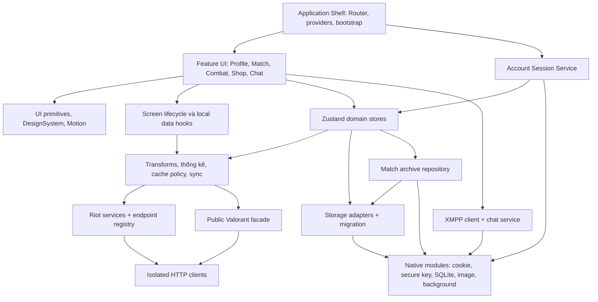

# 11 — Sơ đồ thành phần

Các nhóm triển khai chính và boundary thay thế độc lập.

Network DTO được chuyển sang view model trước khi render bảng/card. Persist
chỉ lưu subset cần thiết, không lưu promise hoặc loading flags. Tracer/log là
chẩn đoán opt-in, không phải dependency cần thiết để app hoạt động.

Nguồn: [cấu trúc dự án](../DIRECTORY_STRUCTURE.md), [HTTP clients](../services/http/clients.ts),
[match facade](../utils/match-ui.ts), [storage](../utils/storage.ts).
Archive contract: [services/matches](../services/matches/match-archive-core.ts).
