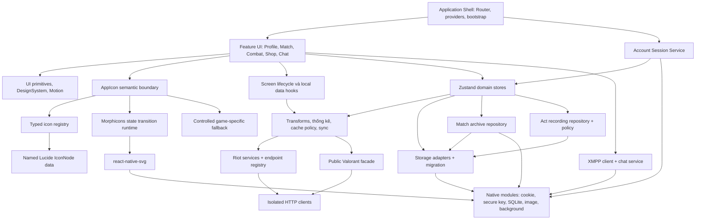

# 11 — Sơ đồ thành phần

Các nhóm triển khai chính và boundary thay thế độc lập.

Network DTO được chuyển sang view model trước khi render bảng/card. Persist
chỉ lưu subset cần thiết, không lưu promise hoặc loading flags. Tracer/log là
chẩn đoán opt-in, không phải dependency cần thiết để app hoạt động.

`AppIcon` là nơi duy nhất biết vendor. UI chỉ dùng semantic token có type;
Lucide cung cấp path data, Morphicons chuyển trạng thái và `react-native-svg`
render SVG native. Fallback MaterialCommunityIcons chỉ giữ pictogram
Valorant-specific không có hình tương đương chính xác. Fallback không path-morph
với Lucide; wishlist selected giữ cùng Heart path và chỉ đổi fill. Icon con của
control đã có label là decorative, còn icon-only chỉ tạo một accessibility node;
mọi morph dùng `reducedMotion="user"`.

Nguồn: [cấu trúc dự án](../DIRECTORY_STRUCTURE.md), [HTTP clients](../services/http/clients.ts),
[match facade](../utils/match-ui.ts), [storage](../utils/storage.ts).
Archive contract: [services/matches](../services/matches/match-archive-core.ts).
Recording contract: [match recording](../services/matches/match-recording-core.ts).
Icon contract: [AppIcon](../components/ui/AppIcon.tsx) và
[semantic registry](../components/ui/app-icon-registry.ts).
