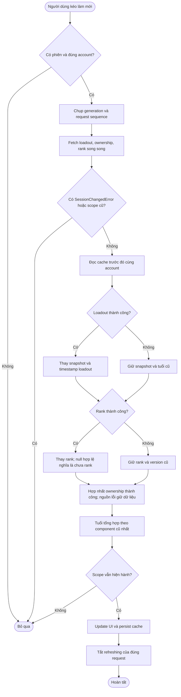

# 12 — Sơ đồ hoạt động: refresh Profile

Hoạt động song song được gom trong khối fetch; nhánh partial failure không
được xoá dữ liệu đã biết hoặc đánh dấu nguồn lỗi là fresh.

Guard đã thử lần đầu theo mount/auth ngăn partial cache write tự kích hoạt
vòng fetch vô hạn. Người dùng vẫn có thể kéo refresh để thử lại. Mutation
loadout có version riêng để GET chạy trước mutation không ghi đè kết quả mới.
Đổi tab Tổng quan/Chi tiết là state trình bày riêng và không đi qua activity
fetch này; hai panel đã render chỉ đổi opacity/transform trên UI thread.

Nguồn: [Profile fetch](../features/profile/useProfileFetch.ts),
[refresh cache builder](../features/profile/profile-refresh-data.ts),
[warm cache](../utils/profile-cache.ts), [loadout cache](../services/riot/loadout-cache.ts),
[dashboard tab store](../features/profile/useProfileDashboardTabStore.ts).
