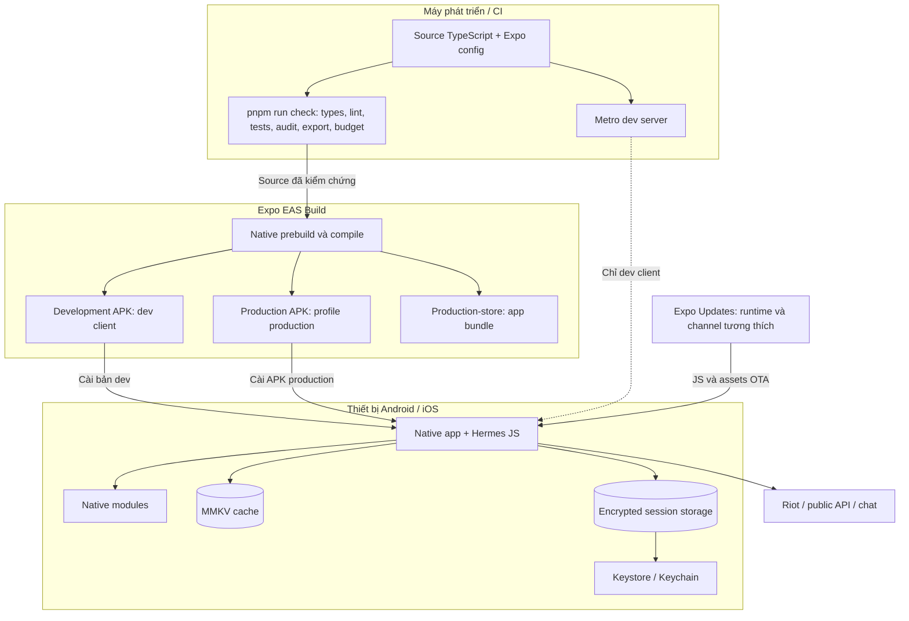

# 13 — Sơ đồ triển khai

Phân biệt pipeline tạo artifact và runtime. Build/config dưới đây tồn tại
trong repository; trạng thái release cụ thể cần đối chiếu bản ghi build.

Android/iOS trong repo là output prebuild, không phải nguồn cấu hình chính.
Nguồn là `app.json`, plugin Expo và TypeScript. `production` xuất APK;
`production-store` xuất AAB. iOS cần pipeline và signing tương ứng, không
được suy ra đã build chỉ vì Android thành công. OTA không thay native binary.

Nguồn: [eas.json](../eas.json), [app.json](../app.json),
[quality workflow](../.github/workflows/quality.yml), [build rules](../BUILD_DESIGN_SYSTEM.md).
