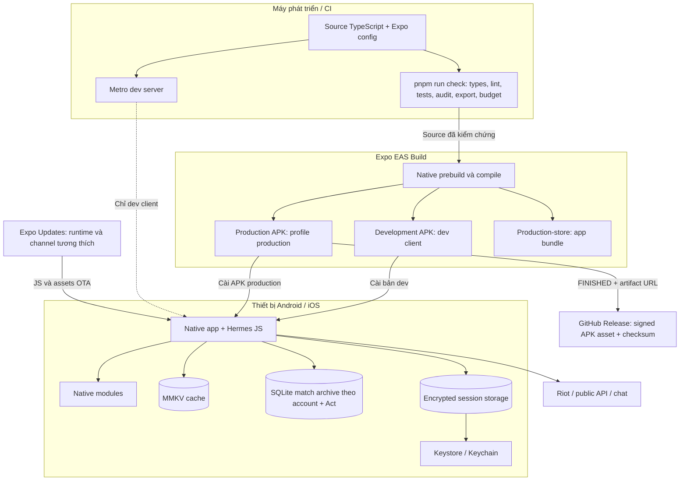

# 13 — Sơ đồ triển khai

Phân biệt pipeline tạo artifact và runtime. Build/config dưới đây tồn tại
trong repository; trạng thái release cụ thể cần đối chiếu bản ghi build.

Android/iOS trong repo là output prebuild, không phải nguồn cấu hình chính.
Nguồn là `app.json`, plugin Expo và TypeScript. `production` xuất APK;
`production-store` xuất AAB. iOS cần pipeline và signing tương ứng, không
được suy ra đã build chỉ vì Android thành công. OTA không thay native binary.

Release 4.1.8 sẽ dùng EAS build production cuối từ commit source đã kiểm chứng,
package `com.android.vshop`, version/code `4.1.8/89`. Candidate
`ebcdfbea-913a-4b67-84d1-9b00c2a81382` bị thay thế vì có trước guard archive và
căn chỉnh patch SDK 57. Git chỉ chứa source và release metadata; APK cuối được
đính kèm ngoài Git tại GitHub Release `v4.1.8` sau khi đạt `FINISHED` và kiểm tra checksum.

Nguồn: [eas.json](../eas.json), [app.json](../app.json),
[quality workflow](../.github/workflows/quality.yml), [build rules](../BUILD_DESIGN_SYSTEM.md).
