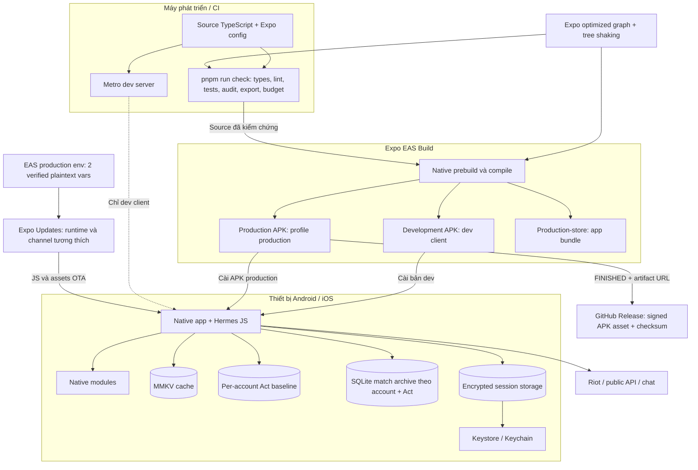

# 13 — Sơ đồ triển khai

Phân biệt pipeline tạo artifact và runtime. Build/config dưới đây tồn tại
trong repository; trạng thái release cụ thể cần đối chiếu bản ghi build.

Android/iOS trong repo là output prebuild, không phải nguồn cấu hình chính.
Nguồn là `app.json`, plugin Expo và TypeScript. `production` xuất APK;
`production-store` xuất AAB. iOS cần pipeline và signing tương ứng, không
được suy ra đã build chỉ vì Android thành công. OTA không thay native binary.
Baseline là metadata local nhỏ qua storage adapter; SQLite vẫn giữ archive và
không đồng bộ mốc này giữa thiết bị.

Gate export local và các EAS build profile dùng
`EXPO_UNSTABLE_METRO_OPTIMIZE_GRAPH=1` cùng
`EXPO_UNSTABLE_TREE_SHAKING=1`; `production-store` kế thừa production. EAS
project `@hyeon004/vshop` production environment cũng đã set/verify hai giá trị
dạng plaintext, nên future `eas update --environment production` dùng cùng
optimizer. Đây không phải bằng chứng tương thích runtime: source 4.1.9 có native
dependency mới và tuyệt đối không được OTA vào binary/runtime 4.1.8.

Optimized static export 4.1.9 đã PASS budget 10,16/12 MiB tổng, 7,69/8 MiB
Hermes và 1,25/1,50 MiB asset lớn nhất. Native EAS build, APK install và runtime
thiết bị 4.1.9 vẫn **NOT VERIFIED**.

Release 4.1.8 dùng EAS build
[`6e0a0273-9bac-46c5-b1d8-66c230b24557`](https://expo.dev/accounts/hyeon004/projects/vshop/builds/6e0a0273-9bac-46c5-b1d8-66c230b24557)
từ commit `7e42d64`, package `com.android.vshop`, version/code `4.1.8/89`.
Build đạt `FINISHED`; APK ký có SHA-256
`554AE2715CE64639413CD98F5318B26E23D6803A66B1CFD4303749F737157224`.
Git chỉ chứa source và release metadata; APK được đính kèm ngoài Git tại
GitHub Release `v4.1.8`. Runtime production chưa được kiểm chứng vì thiết bị ADB
không còn kết nối sau khi artifact hoàn tất.

Nguồn: [eas.json](../eas.json), [app.json](../app.json),
[quality workflow](../.github/workflows/quality.yml), [build rules](../BUILD_DESIGN_SYSTEM.md).
