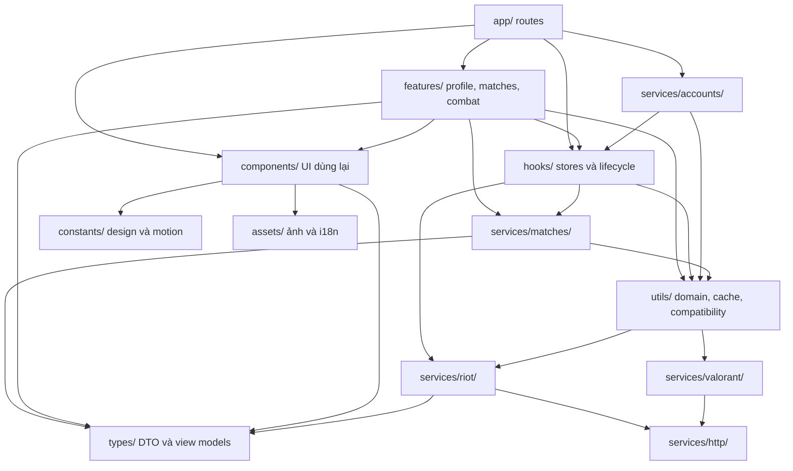

# 14 — Sơ đồ gói

Gói ở đây là nhóm thư mục của TypeScript, không phải tất cả đều là package npm.
Đây là chiều phụ thuộc chính, không phải đồ thị đầy đủ từng import.

Một số `utils` tương thích cũ re-export service, nên không diễn giải hình này
như quy tắc cấm mọi dependency ngược giữa `utils` và `hooks`. Ví dụ warm cache
đọc persisted Profile store để giữ dữ liệu tốt sau cold start. Không tạo vòng
runtime chỉ để chia file; import chỉ dùng type cần dùng `import type`.

Nguồn: [DIRECTORY_STRUCTURE](../DIRECTORY_STRUCTURE.md),
[valorant facade](../utils/valorant-api.ts), [match facade](../utils/match-ui.ts).
Kho theo Act nằm sau [services/matches](../services/matches/match-archive-core.ts),
không được triển khai trực tiếp trong route hoặc component Profile. Cùng package
này sở hữu [recording baseline](../services/matches/match-recording-core.ts);
`features/matches` chỉ điều phối và mirror identity vào Zustand.
