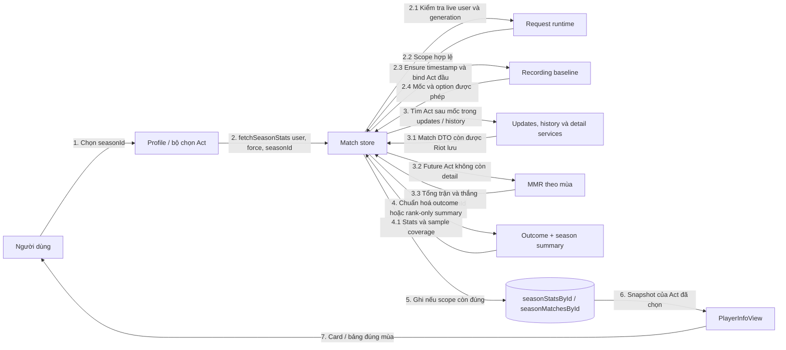

# 15 — Sơ đồ liên lạc (Communication)

Tập trung vào **ai gửi thông điệp cho ai**; số thứ tự biểu diễn tiến trình.
Khác với Sequence, vị trí dọc không mang ý nghĩa thời gian.

Cache fresh có thể bỏ qua bước 3. Có phân biệt force và request hiện có;
response cũ không được ghi đè lựa chọn mới. Khi Riot không còn match detail
của Act mở sau baseline, MMR chỉ cung cấp tổng trận/thắng-thua; các metric combat phải để
`--`, không suy diễn thành 0. Kết quả huỷ/chưa rõ không được chuyển thành thua
và không được tính vào mẫu số win rate. Start Act bị clamp tới timestamp và
không đi qua MMR full-Act.

Nguồn: [season actions](../features/matches/season-actions.ts),
[outcome](../utils/match-result.ts), [summary](../features/matches/season-summary.ts),
[MMR fallback](../features/matches/season-mmr-summary.ts),
[recording baseline](../services/matches/match-recording-core.ts),
[dashboard](../components/profile/PlayerInfoView.tsx).
