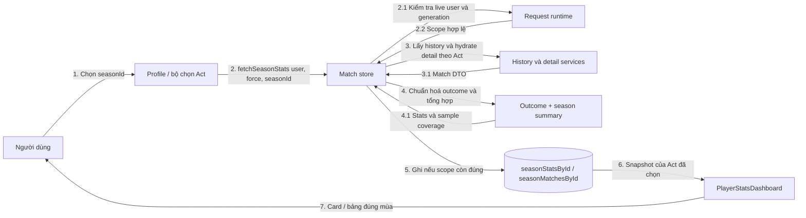

# 15 — Sơ đồ liên lạc (Communication)

Tập trung vào **ai gửi thông điệp cho ai**; số thứ tự biểu diễn tiến trình.
Khác với Sequence, vị trí dọc không mang ý nghĩa thời gian.

Cache fresh có thể bỏ qua bước 3. Có phân biệt force và request hiện có;
response cũ không được ghi đè lựa chọn mới. Kết quả huỷ/chưa rõ không được
chuyển thành thua, và không được tính vào mẫu số win rate.

Nguồn: [season actions](../features/matches/season-actions.ts),
[outcome](../utils/match-result.ts), [summary](../features/matches/season-summary.ts),
[dashboard](../components/profile/PlayerStatsDashboard.tsx).
