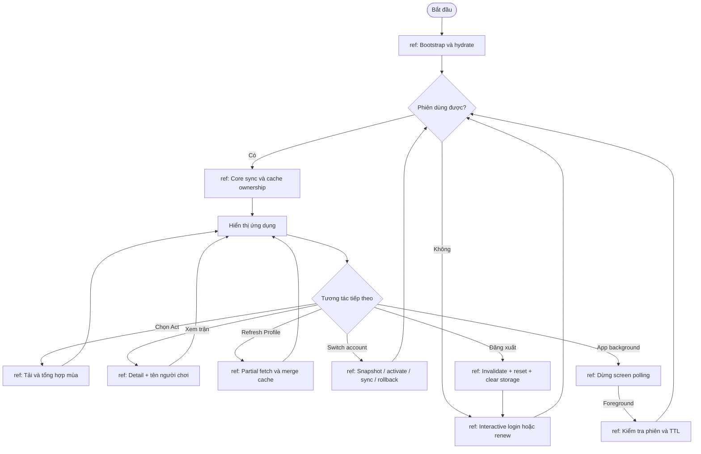

# 16 — Tổng quan tương tác (UML 2.0)

Các khối `ref` là tương tác con được mô tả ở các sơ đồ khác; hình này không
liệt kê từng HTTP call. Dùng flowchart thay ký pháp UML chuyên dụng.

Tham chiếu: [Flowchart](01-flowchart.md), [Sequence switch](08-sequence.md),
[Activity refresh](12-activity.md), [Communication mùa](15-communication.md).
Quay lại foreground không luôn đồng nghĩa full sync: ưu tiên cache/TTL và
trạng thái session recovery hiện tại.

Nguồn: [AppWarmup](../components/AppWarmup.tsx), [app-sync](../utils/app-sync.ts),
[screen activity](../features/combat/useCombatScreenActivity.ts).
