# 17 — Sơ đồ phối hợp thời gian (Timing)

Minh hoạ race logout/request theo các mốc logic `t0…t6`. **Các giây trong
Mermaid chỉ là đơn vị vẽ**, không phải số đo tốc độ thật hoặc cam kết độ trễ.
Gantt được dùng để biểu diễn các dải trạng thái tương đương Timing Diagram.

```mermaid
gantt
    title Request cũ không được ghi sau khi session bị invalidated
    dateFormat X
    axisFormat %S
    section Session
    Generation G0                  :g0, 0, 2s
    Generation G1 sau logout       :g1, 2, 1s
    Generation G2 đăng nhập mới    :g2, 3, 3s
    section Request A
    Fetch với G0                   :a0, 0, 4s
    Response cũ bị loại            :milestone, a1, 4, 0s
    section Store
    Dữ liệu account A              :s0, 0, 2s
    Reset                          :s1, 2, 3s
    Dữ liệu từ request B           :s2, 5, 1s
    section Request B
    Fetch với G2                   :b0, 3, 2s
    Publish hợp lệ                 :milestone, b1, 5, 0s
```

| Mốc | Sự kiện | Điều kiện bất biến |
|---|---|---|
| t0 | A chụp scope G0, bắt đầu fetch | Chưa có quyền ghi vô điều kiện |
| t2 | Logout tăng generation/reset store | A không còn current |
| t3 | Phiên mới bắt đầu request B | Không join promise A |
| t4 | A trả response | Không ghi state/cache và không tắt spinner B |
| t5 | B trả response | Chỉ publish nếu account/token/generation còn đúng |

Đĩa có một thứ tự bổ sung: clear startup marker chờ write trước đó; migration
storage cũng tuần tự hoá copy/write/remove theo key. Read cũ trả về sau một
write/reset mới bị loại, tránh hydrate lại dữ liệu đã xoá.
Archive mùa áp dụng hàng đợi write riêng cho từng `(accountKey, seasonId)`;
request khác scope có thể tiến triển độc lập nhưng không được merge chéo account.

Nguồn: [session generation](../utils/session-operations.ts),
[request runtime](../features/matches/request-runtime.ts),
[startup queue](../utils/startup-cache.ts), [storage migration](../utils/storage-migration.ts),
[archive write queue](../services/matches/match-archive-core.ts).
